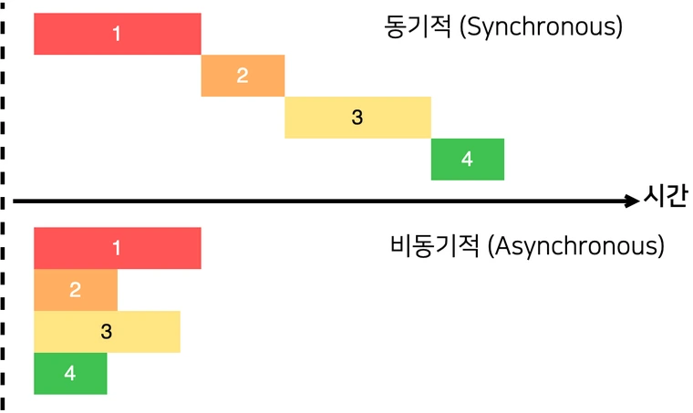

### [공부자료 : 모던 자바스크립트 Deep Dive - 이웅모](https://poiemaweb.com/)

### 기존에는 비동기 처리를 “콜백 함수”를 통해서 해왔다.

## 콜백함수의 단점

비동기 함수의 경우 비동기로 동작하는 코드가 완료되지 않았다고 해도 기다리지 않고 즉시 종료된다.

**비동기로 동작하는 코드는 비동기 함수가 종료된 이후에 완료된다.**



```jsx
const get = (url) => {
  const xhr = new XMLHttpRequest();
  xhr.open("GET", url);
  xhr.send();

  // 비동기 메서드 onload
  xhr.onload = () => {
    if (xhr.status === 200) {
      return JSON.parse(xhr.response);
    }
    console.error(`${xhr.status} ${xhr.statusText}`);
  };
};

const response = get("https://jsonplaceholder.typicode.com/posts/1");
console.log(response); // undefined
```

위 코드에서는 get함수는 비동기 함수이다.

함수 내에 onload 이벤트 핸들러가 비동기로 동작하기 때문이다.

- get함수 자체에 대한 리턴이 없고 onload안에 리턴문이 존재한다.
- 근데 onload는 비동기로 동작하므로 get함수가 종료된 이후에 실행된다.
  - onload는 get함수가 실행하는게 아니기 때문.

→ onload 함수내에서 console.log를 실행시키면 값을 읽어올 수는 있겠지만 여전히 response에는 영향을 주지 않는다.

```jsx
const response = get('https://jsonplaceholder.typicode.com/posts/1');
console.log(response);
console.log(response);
console.log(response);
console.log(response);
console.log(response);
.
. // 100만번
.
console.log(response);
```

> 과연 출력이 될까
>
> 처음에 공부할때는 왠지 값을 전달받는 시간이 필요하므로 100만번 출력하는 도중 값을 전달받아 출력이 될것만 같았다.
>
> 하지만 좀만 더 공부해보니 선언하는 시점에 이미 값을 전달받기전 값이 할당되어 정상적인 값이 아니므로 원하는 값은 100만번이 아니라 무한히 하더라도 출력될 수 없다.
>
> 위 예시는 선언된 시점을 보면 쉽게 이해할 수 있다.

## 궁금한점.. p846

“서버로부터 응답이 도작하면 xhr 객체에서 load 이벤트가 발생한다.

이때 이벤트 핸들러가 즉시 실행되는것이 아니라

태스크 큐에 저장 → 콜스택이 비면 이벤트 루프에 의해 콜스택으로 푸시되어 실행”

?? xhr.onload 이벤트 핸들러가 실행되는 시점에는 콜 스택이 빈 상태여야 하므로 console.log가 이미 종료된 이후이다.

만약 get함수 이후에 console.log가 100번 호출된다하더라도

xhr.onload 이벤트 핸들러는 모든 console.log가 종료한 이후에 실행된다.

상위 스코프 변수에 할당하려해도 할당하기 전에 console.log가 먼저 실행된다.

```jsx
let g = 0;

setTimeout(() => { g = 100; }, 0); // 4ms 기본
console.log(g);
console.log(g);
console.log(g);
console.log(g);
console.log(g);
.
. // 1000만번
.
console.log(g);
```

> 과연 출력이 될것인가 안될것인가
>
> ### 실행과정
>
> 1. `g` 변수가 0으로 초기화됩니다.
> 2. `setTimeout()` 함수가 호출되고, 콜백 함수가 대기열에 추가됩니다.
> 3. `console.log(g)`가 실행되고, `g`의 현재 값인 0이 출력됩니다. 즉, 콜백 함수가 아직 실행되지 않았습니다.
> 4. 다시 `console.log(g)`가 실행되고, 역시 `g`의 현재 값인 0이 출력됩니다.
> 5. 위의 과정을 총 5번 반복하여 모두 `g`의 현재 값인 0이 출력됩니다.
>    그 후 이벤트 루프가 실행되면서 `setTimeout()`으로 등록한 콜백 함수가 대기열에서 꺼내져 실행됩니다. 콜백 함수가 실행되면 `g`의 값이 100으로 변경되지만, 위의 `console.log()` 호출에서는 이미 이전에 실행된 상태이므로 변경된 값을 출력하지 않습니다. 따라서 위의 코드에서는 모두 `0`이 출력됩니다.
>
> ### 이벤트 루프는 모든 코드 실행후에
>
> JavaScript의 이벤트 루프는 코드 실행이 완료된 후에 이벤트 루프가 실행됩니다.
> JavaScript는 단일 스레드로 동작하기 때문에, 코드의 실행은 한 번에 하나의 작업만 처리됩니다. 따라서 > > 모든 코드가 실행된 후에야 이벤트 루프가 시작되며, 이벤트 루프는 대기 중인 작업을 처리하고 콜백 함수를 실행합니다.

### 비동기 함수에 대한 처리는 기존 자바스크립트에서는 콜백함수를 전달하여 해결해왔다.

```jsx
const get = (url, successCallback, failureCallback) => {
  const xhr = new XMLHttpRequest();
  xhr.open("GET", url);
  xhr.send();

  xhr.onload = () => {
    if (xhr.status === 200) {
      successCallback(JSON.parse(xhr.response));
    }
    failureCallback(xhr.status);
  };
};

get("https://jsonplaceholder.typicode.com/posts/1", console.log, console.error);
```

! 만약 콜백함수를 통해 후속처리후에 그 결과를 통해 또다시 비동기 함수를 호출한다면?

콜백 함수가 중첩되어 복잡도 상승..

## 일명 콜백 헬 Callback Hell

```jsx
function getData(callback) {
  setTimeout(() => {
    callback("Data received");
  }, 1000);
}

function processData(data, callback) {
  setTimeout(() => {
    callback(data.toUpperCase());
  }, 1000);
}

getData((data) => {
  processData(data, (processedData) => {
    console.log(processedData);
  });
});
```

```jsx
function getData() {
  return new Promise((resolve, reject) => {
    setTimeout(() => {
      resolve("Data received");
    }, 1000);
  });
}

function processData(data) {
  return new Promise((resolve, reject) => {
    setTimeout(() => {
      resolve(data.toUpperCase());
    }, 1000);
  });
}

getData()
  .then((data) => processData(data))
  .then((processedData) => console.log(processedData))
  .catch((error) => console.error(error));
```

결국 프로미스를 쓰더라도 중첩구조이긴한거 아닌가?

## 콜백함수의 첫번째 단점 : 콜백헬

## 콜백함수의 두번째 단점 : 에러처리의 한계

```jsx
try {
  setTimeout(() => {
    throw new Error("Error!!!!");
  }, 1000);
} catch (e) {
  console.log(e); // 영원히 실행되지 않는다.
}
```

코드의 의도상 1초뒤에 에러를 발생하므로 1초뒤에 콘솔에 에러가 출력되어야 맞겠지만

위에서 catch문은 영원히 실행되지 않는다.

```jsx
try {
  setTimeout(() => {
    throw new Error("Error!!!!");
  }, 0);
} catch (e) {
  console.log(e);
}
```

> 그럼 이건 안될까요?
>
> 위에 시간을 0으로 바꾸어도 결과는 그대로

## 외않되?

- setTimeout이 비동기 함수이므로 이미 코드가 종료되고나서 에러가 실행되기 때문에 catch문은 해당 에러를 잡지 못한다.

```jsx
const callback = () => {
  throw new Error("Error!!!!");
};

try {
  setTimeout(callback, 1000);
} catch (e) {
  console.log(e); // 영원히 실행되지 않는다.
}
```

1. setTimeout은 비동기 함수이므로 콜백함수가 호출되는 것을 기다리지 않고 즉시 종료되어 콜스택에서 제거된다.
2. 콜백함수는 타이머가 만료되면, 태스크 큐로 푸시
3. 콜스택이 비면 이벤트 루프에 의해 콜스택으로 푸시되어 실행

이때 콜백함수가 실행될때는 이미 setTimeout은 콜스택에서 제거된 상태이다.

→ 콜백함수를 호출한 것이 setTimeout이 아니라는 의미

## 만약 콜백함수를 호출자가 setTimeout이 되려면?

실행중인 실행컨택스트가 콜백함수의 실행컨택스트일때 하위 실행 컨택스트가 setTimeout이어야하는데 이미 제거된 이후라서.. 아니다.

### 에러는 호출자 방향으로 전파된다.

따라서 콜백함수의 호출자는 setTimeout이 아니므로 catch문은 콜백함수의 에러를 잡지 못한다.

## 번외

promise를 몰랐을때, 비동기처리를 몰랐을때 스테이트 부분 업데이트를 몰랐을때..

```jsx
axios
  .get(`${domain}:8000/api/champion/detail/?id=` + info.data?.op_top, header)
  .then((response1) => {
    axios
      .get(
        `${domain}:8000/api/champion/detail/?id=` + info.data?.op_jng,
        header
      )
      .then((response2) => {
        axios
          .get(
            `${domain}:8000/api/champion/detail/?id=` + info.data?.op_mid,
            header
          )
          .then((response3) => {
            axios
              .get(
                `${domain}:8000/api/champion/detail/?id=` + info.data?.op_adc,
                header
              )
              .then((response4) => {
                axios
                  .get(
                    `${domain}:8000/api/champion/detail/?id=` +
                      info.data?.op_sup,
                    header
                  )
                  .then((response5) => {
                    setopImg({
                      top: {
                        name: response1.data.name,
                        url: response1.data.image_url,
                      },
                      jng: {
                        name: response2.data.name,
                        url: response2.data.image_url,
                      },
                      mid: {
                        name: response3.data.name,
                        url: response3.data.image_url,
                      },
                      adc: {
                        name: response4.data.name,
                        url: response4.data.image_url,
                      },
                      sup: {
                        name: response5.data.name,
                        url: response5.data.image_url,
                      },
                    });
                  });
              });
          });
      });
  });
```

## 이러한 문제를 개선한 Promise!~

- 응답을 undefined로 출력하는 문제
- 에러캐치를 하지 못하는 문제

```jsx
const promise = new Promise((resolve, reject) => {
  if (성공) {
    resolve("result");
  } else {
    reject("failure reason");
  }
});
```

성공했을때와 에러가 발생했을때의 처리를 수행할 콜백함수를 인자로 받는다.

## 세가지 상태를 가지는 Promise

- pending - 비동기 처리가 아직 수행되지 않은 상태
- settled - 비동기 처리가 수행된 상태
  - fulfilled - 성공
  - rejected - 실패

### 상태가 바뀌면 함수를 호출하는것이 아닌, 함수가 호출되면 상태가 바뀐다!

- resolve 함수를 호출하여 프로미스를 fulfilled 상태로 변경
- reject 함수를 호출하여 프로미스를 rejected 상태로 변경

### 이미 settled 상태가 되었다면 다른 상태로 변할수는 없다.

## Promise의 후속처리 then, catch, finally

```jsx
new Promise((resolve) => resolve("fulfilled")).then(
  (v) => console.log(v),
  (e) => console.error(e)
);

new Promise((_, reject) => reject(new Error("rejected"))).then(
  (v) => console.log(v),
  (e) => console.error(e)
);
```

- promise는 두 개의 콜백함수를 인자로 받으며 첫번째는 성공을 처리 두번째는 에러를 처리한다.

### then은 언제나 프로미스를 반환한다

- then이 프로미스를 반환하면 그대로 리턴하고
- 만약 프로미스가 아닌것을 반환하면 암묵적으로 그 값을 (resovle 혹은 reject하여) 프로미스를 생성해 반환한다.

### catch는 then(unedfined, onRejected)와 동일하게 동작한다.

```jsx
new Promise((_, reject) => reject(new Error("rejected"))).catch((e) =>
  console.error(e)
);

new Promise((_, reject) => reject(new Error("rejected"))).then(unedfined, (e) =>
  console.error(e)
);
```

### 뭐야.. 그럼 then하나로 다되잖아 ?

### No → 완벽하게 동일하지 않다!

- then의 두번째 콜백함수는 첫번째 콜백함수에서 발생한 에러를 캐치하지 못한다.
- 코드가 복잡해진다.
- 가독성이 떨어진다.
- catch문을 사용할 경우 then의 첫번째 콜백함수에서 발생한 에러까지 캐치가 가능하다.

```jsx
promiseGet("...").then(
  (res) => console.ffff(res),
  (err) => console.error(err)
);
// 에러가 발생하지 않는다.

promiseGet("...")
  .then((res) => console.ffff(res))
  .catch((err) => console.error(err)); // TypeError: console.ffff is not a function
```

→ 따라서 책에서는 then으로 한번에 처리, 혹은 then의 두번째 인자를 이용해서 에러처리를 하는것보다 catch문을 사용하는 것을 권장
