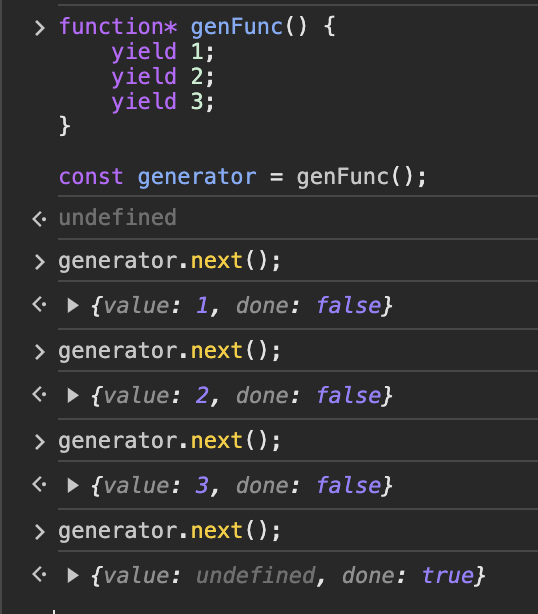
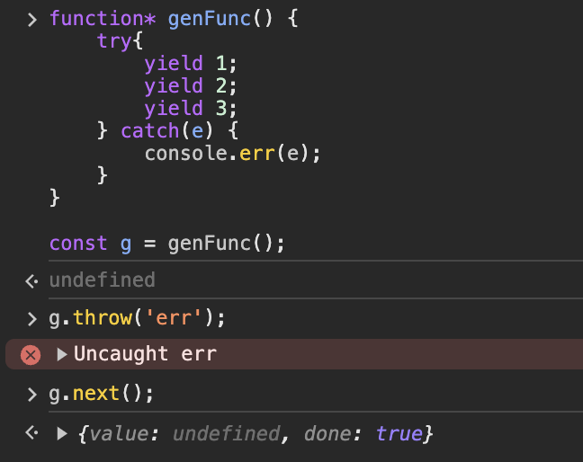

### [공부자료 : 모던 자바스크립트 Deep Dive - 이웅모](https://poiemaweb.com/)

## 제너레이터 generator

코드 블록의 실행을 일시 중지했다가 필요한 시점에 재개할 수 있는 특징이 있다.

1. 함수 호출자에게 실행의 제어권을 양도한다.
   - 필요한 시점에 재개
2. 호출자와 상태를 주고 받을 수 있다.
   - 재개하면서 값을 중간에 전달할 수 있다.
3. 이터러블이면서 이터레이터인 제너레이터 객체를 반환한다.
   - 재개할때 next() 메소드 사용

## 제너레이터 함수 정의

- function\* 키워드로 선언
- 하나 이상의 yield 표현식을 포함

```jsx
// 함수선언문
function* genFunc() {
  yield 1;

  yield 1;

  yield 1;

  yield 1;
}

// 함수표현식
const genFunc = function* () {
  yield 1;
};

// 메서드
const obj = {
  *genMethod() {
    yield 1;
  },
};

// 클래스 메소드
class MyClass {
  *genMethod() {
    yield 1;
  }
}
```

```jsx
function* genFunc() // 권장
function *genFunc()
function * genFunc()
function*genFunc()
```

### 화살표 함수로 정의할 수 없다

```jsx
const genFunc = * () => {
	yield 1;
};
```

### new 연산자도 불가

```jsx
function* genFunc() {
  yield 1;
}

new genFunc(); // x
```

## 제너레이터 객체는 이터러블이면서 이터레이터이다.

→ 순회가 가능하고 next 메소드를 소유한다.

```jsx
function* genFunc() {
  yield 1;
  yield 2;
  yield 3;
}

const generator = genFunc();
```

### next 메서드 호출하면 yield까지 실행, value에 yield 값 반환



### return 메서드 호출하면 끝으로 이동, value에는 인수로 전달받은 값

```jsx
function* genFunc() {
  yield 1;
  yield 2;
  console.log(123123);
  yield 3;
}

const generator = genFunc();

generator.return();
// {value: undefined, done: true}

generator.return(300);
// {value: 300, done: true}
```

### 퀴즈1

```jsx
function* genFunc() {
  yield 1;

  yield 2;

  yield 3;

  return 100;
}

const generator = genFunc();

generator.return();
// {value: ??, done: true}
```

> 답
>
> undefined
>
> 전달 받은 인자만 리턴한다.

### 퀴즈2

```jsx
function* genFunc() {
  yield 1;
  yield 2;
  yield 3;
  return 400;
}

const generator = genFunc();

generator.return(300);
// {value: ??, done: true}
```

> 답
>
> 300

### throw 메서드는 전달 받은 에러를 발생시킨다.



## 제너레이터 next 메서드는 인자를 전달할 수 있다.

```jsx
function* genFunc() {
  const x = yield 1;

  const y = yield x + 10;

  return x + y;
}

const generator = genFunc();

generator.next(); // {value: 1, done: false}
generator.next(10); // {value: 20, done: false}
generator.next(300); // {value: 310, done: true}
```

?? 이해가 안돼요…

### 제너레이터를 활용하는 예시

피보나치 수열 리턴하는 함수

```jsx
const fibo = (function () {
  let [pre, cur] = [0, 1];

  return {
    [Symbol.iterator]() {
      return this;
    },
    next() {
      [pre, cur] = [cur, pre + cur];
      return { value: cur };
    },
  };
})();

for (const num of fibo) {
  if (num > 10000) break;
  console.log(num);
}
```

제너레이터 사용시

```jsx
const genFibo = (function* () {
  let [pre, cur] = [0, 1];

  while (true) {
    [pre, cur] = [cur, pre + cur];
    yield cur;
  }
})();

for (const num of genFibo) {
  if (num > 10000) break;
  console.log(num);
}
```

## async / await는 제너레이터보다 가독성 좋게 비동기 처리를 지원한다.

→ function\* / yield → async / await

### await 키워드는 반드시 async 함수내부에서 사용해야한다.

### async 함수는 언제나 프로미스를 반환한다.

### await은 프로미스 앞에서 사용해야한다.

```jsx
const getData = async (id) => {
  const res = await fetch(".../${id}");

  const { name } = await res.json();

  console.log(name);
};

getData(234);
```

await은 프로미스가 settled 상태가 될때까지 대기

settled 상태가 되면 resolve한 처리결과를 반환한다.

### 앞선처리 결과를 가지고 다음 비동기 처리를 수행해야할 경우

```jsx
async function bar(n) {
  const a = await new Promise((resolve) => setTimeout(() => resolve(n), 3000));
  const b = await new Promise((resolve) =>
    setTimeout(() => resolve(a + 1), 4000)
  );
  const c = await new Promise((resolve) =>
    setTimeout(() => resolve(b + 1), 1000)
  );

  console.log([a, b, c]); // ??
}

bar(5);
```

> 걸리는 시간과 답
>
> 8초
>
> [5, 6, 7]

## 에러처리

기존 콜백패턴에서는 try catch문으로 에러 캐치가 불가능했다.

```jsx
try {
  setTimeout(() => {
    throw new Error("에러야");
  }, 1000);
} catch (e) {
  console.error(e);
}

// 에러 캐치를 못하고 정상적으로 수행된다.
```

프로미스를 반환하는 비동기함수는 명시적으로 호출할 수 있기 때문에 호출자가 명확하다.

→ 리턴동안 기다리기 때문에(위 콜백함수는 기다리지 않고 다음을 실행함) 상위 함수가 실행컨텍스트에서 제거되지 않고 그 함수가 호출자이기 떄문에 명확하다.

```jsx
const foo = async () => {
  try {
    const errorUrl = "https://nnaavveerr";

    const res = await fetch(errorUrl).then;
    const fsadfsda = res.logData + 3;
    const data = await fsadfsda.json();

    setState;
    setState;
    setState;

    console.log(data);
  } catch (e) {
    console.error(e);
  }
};

foo();
```

만약!

async 함수내에서 catch 문을 사용해서 에러처리를 하지 않는 다면 reject하는 프로미스를 반환하기에 catch 후속처리 메소드를 사용하는 방법도 있다.

```jsx
const foo = async () => {
  const errorUrl = "https://nnaavveerr";

  const res = await fetch(errorUrl);
  const data = await res.json();

  return data;
};

foo().then(console.log).catch(console.error);
```
