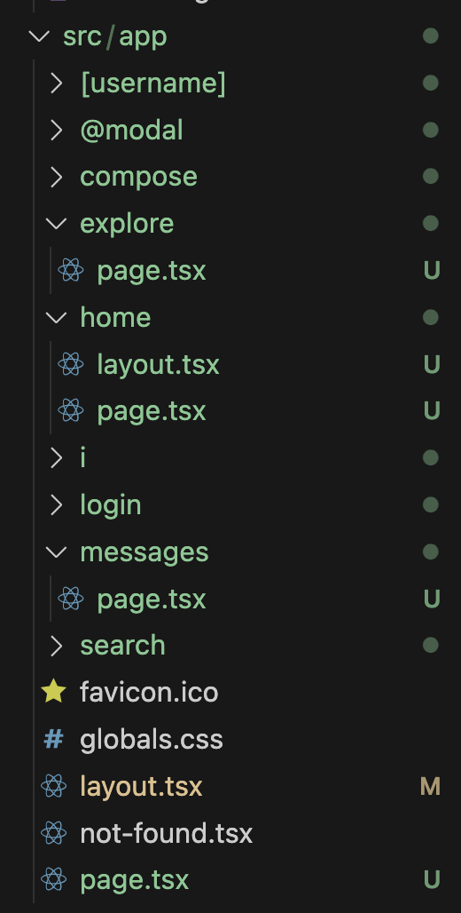
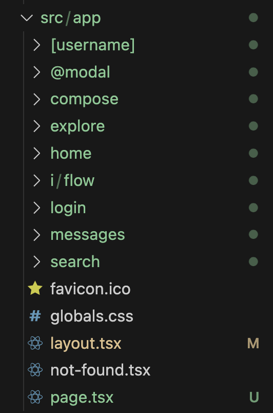
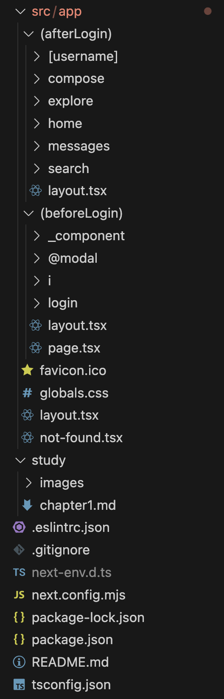
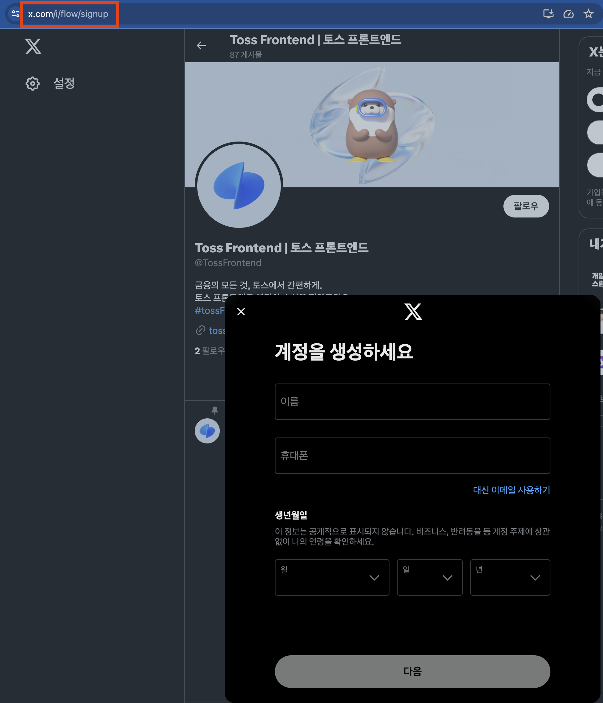

## 12버전까지 next의 아쉬움중의 하나는 layout

기존에 쓰던 layout 패턴

https://nextjs.org/docs/pages/building-your-application/routing/pages-and-layouts#layout-pattern

### 리액트로 공통된 ui에 대해서 구현하고자 할때는

```tsx
import { Routes, Route, Outlet, Link } from 'react-router-dom';

export default function App() {
	return (
		<div>
			<div>Routes 외부의 공통영역</div>

			<Routes>
				<Route ... />
				...
			</Routes>
		</div>
	)
}
```

위와 같이 Routes 외부에 위치시킨다.

next에서는 13버전 이전까지는 모든페이지가 물리적으로 구별된 파일로 독립되어있었다.

공통으로 집어넣을 수 있는 곳은 \_\_document, \_app 이 유일하다

### \_document

- \<html> \<body>를 수정
- styled components와 같은 일부 CSS inJS를 지원하기 위한 코드를 삽입
- 서버에서만 작동하므로 이벤트 핸들러나 클라이언트 로직은 쓸 수 없다.

### \_app

- 페이지 변경시에도 유지하고 싶은 레이아웃이나 상태
- componentDisCatch를 활용한 에러 핸들링
- 페이지간 추가적인 데이터삽입
- global CSS 주입

## 13버전 App 디렉터리의 큰 차이점

파일명으로 라우팅하는 것이 불가능해졌다.

### 12버전 이전 page router

`/pages/channel/[handle].tsx`

이거나

`/pages/channel/[handle]/index.tsx`

는 동일한 주소로 변환된다.

### 13버전 이후 app router

`/app/channel/[handle]/page.tsx` 만 허용된다.

즉, 폴더명까지만 주소로 변환된다.

그리고 app내부에서 가질수 있는 파일명은 제한적이다.

## layout.tsx

- 루트에는 단 하나의 layout을 만들어 둘수있다.
- 웹페이지를 만드는데 필요한 공통적인 내용을 다루는 곳이다.
  - 본인과 자식라우팅에만 적용된다.
  - \_app, \_document가 하나로 대체된다.
  - 공통적인 ui를 적용할 수 있다.
  - api 요청같은 비동기작업도 수행할 수 있다.



## page.tsx

page가 받는 props는 다음과 같다.

1. params

   [handle]과 같은 동적라우트 파라미터를 사용할 경우 해당 파라미터 값이 들어가있다.

2. searchParams
   ?q=name&b=3 과 같은 URLSearchParams를 의미한다.
   자바스크립트 객체형태로 제공된다. {”q”:”name, “b”:3}
   이값은 layout.tsx에서는 제공되지 않는데, 이는 layout.tsx 가 페이지 탐색중에 리렌더링 되지않기 때문이다.

## error.tsx, not-found.tsx, route.ts

에러페이지, 404페이지, /pages/api 등

가장 큰 장점은 페이지 그룹별로 세부 설정이 가능해졌다는것!

```tsx
/channel/@민수/playlist/14

/channel/@철수?tab=home

/channel
```

위와같은 channel 이라는 도메인에 공통적인 에러처리, 레이아웃 등이 가능해졌다는 것

- channel
  - [handle]
    - playtlist
      - [playlistId]
        - page.tsx
    - page.tsx
    - error.tsx
  - layout.tsx
  - page.tsx

### 번외



위와 같은 페이지 구조에서,

로그인을 제외한 모든 페이지에서 공통적으로 적용하고자 하는 layout이 있을때 어떻게 해야할까?

로그인을 제외한 모든 폴더 구조에 layout을 넣는것을 처음에 생각했는데 더 좋은 방법이 있었다.

> 정답
>
> ()로 이루어진 폴더로 묶는다. 이 폴더는 라우터에 영향을 주지 않는다.
>
> 

### 한페이지 내에서 두 개의 페이지를 동시에 띄우는 기술

 

트위터의 로그인 창을 보면

띄워지는 동시에 url이 변한다.

이것은 두 가지 페이지를 동시에 띄운 것이다.

이것을 활용하면 뒤로가기를 통해 모달을 끌 수 있으므로 모바일 웹과 웹과 비슷한 사용자 환경을 제시해줄 수 있을것 같다.

앞선 창을 끄게되면 뒤에있는 페이지는 다른 경로 다른 페이지임에도 새로 로드하지 않는다.

> 참고
>
> https://x.com/?lang=ko
>
> https://nextjs.org/docs/app/building-your-application/routing/parallel-routes
