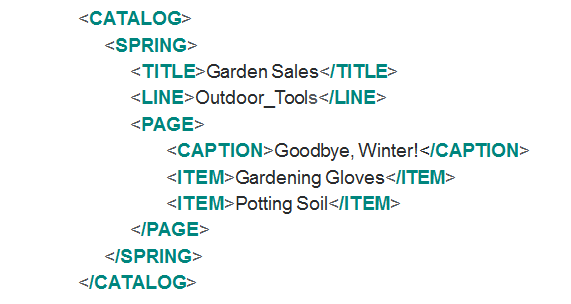

> ### [공부자료 : 모던 리액트 Deep Dive - 김용찬](https://yceffort.kr/2023/10/react-deep-dive)
>
> 주 1회, 진도를 정해서 그룹 스터디를 진행했습니다.
>
> 책을 기반하여 제가 이해하기 쉽게 정리했습니다.
>
> 진행날짜 : 2024-04-11

## JSX

JSX는 JavaScript XML의 약자이다.



XML과 유사한 내장형 구문

리액트에 종속적이지 않은 독자적인 문법

ECMAScript라고 불리는 자바스크립트 표준의 일부는 아니다.

→ 페이스북에서 독자적으로 개발했다

### 반드시 트랜스파일러를 거쳐야 자바스크립트 코드로 변환된다.

```jsx
const Component = (
	<div>{아무 컴포넌트}</div>
)
// SyntaxError : Unexpected token '<'
```

### JSX의 설계 목적

다양한 트랜스파일러에서 다양한 속성을 가진 트리구조를 토큰화해 ECMAScript로 변환한다.

즉, HTML, XML 외에도 다른구문으로도 확장될 수 있게끔 고려되어 있다.

## JSX 구성

- JSXElement
- JSXAttributes
- JSXChildren
- JSXStrings

### JSXElement

HTML 요소와 비슷한 역할을 한다. 다음과 같은 형태여야 한다.

- JSXOpeningElement
  ```jsx
  <div>
  ```
- JSXClosingElement
  ```jsx
  </div>
  ```
- JSXSelfClosingElement
  ```jsx
  <div />
  ```
- JSXFragment
  ```jsx
  <></>
  ```

### HTML 태그명과 사용자지정 컴포넌트 태그명을 구분짓기 위해 대문자로 시작해야한다.

```jsx
// bad
<myComponent>{...}</myComponent>

// good
<MyComponent>{...}</MyComponent>
```

### JSXElementName

JSXElement의 요소 이름으로 쓸 수 있는 것을 의미한다.

- JSXIdentifier

  - 숫자로 시작하거나 $ \_ 외에 다른 특수문자로는 시작할 수 없다.

  ```jsx
  // bad
  <23></23>

  // good
  <$></$>
  <_></_>
  <footer></footer>
  ```

- JSXNamespacedName

  - JSXIdentifier:JSXIdentifier
  - JSXIdentifier의 조합으로 하나의 식별자로 취급된다.
  - 두개이상 연결된것은 올바른 식별자로 취급하지 않는다.

  ```jsx
  // bad
  <foo:bar:oo />

  // good
  <foo:bar />
  ```

- JSXMemberExpression
  - JSXIdentifier.JSXIdentifier
  - JSXNamespacedName과 이어서 사용은 불가능하다
  - 2개이상 이어도 가능하다.
  ```jsx
  <foo.bar.oo />
  ```

### JSXAttributes

- JSXSpreadAttributes
  - {…AssignmentExpression}
  ```jsx
  <MyInput value={value} {...rest} />
  ```
- JSXAttribute
  - 속성을 나타내는 키와 값으로 짝을 이루어서 표현
  - JSXAttributeName = JSXAttributeValue
    - JSXAttributeName에는 JSXElementName 에서 JSXIdentifier와 JSXNamespacedName가 가능하다.
    - JSXAttributeValue
      - “문자열”
      - ‘문자열’
      - { AssignmentExpression }
      - JSXElement
        ```jsx
        <MyTitle title=<Typography>제목임</Typography> />
        ```
        이런식으로도 가능하다.
        ```jsx
        <MyTitle title={<Typography>제목임</Typography>} />
        ```
        이게 더 익숙한 이유는 문법적인 오류가 아닌 prettier규칙이다.
        jsx 구문을 더 읽기 쉽게 제공된 부분이다.

### JSXChildren

JSXElement의 자식 값을 나타낸다. 자식값은 0개 이상 가질 수 있다.

- JSXText
  - { < > } 을 제외한 문자열 (jsx 문법과 혼동을 줄 수 있기 때문이다.)
- JSXElement
- JSXFragment
- { JSXChildExpression (optional) }
  ```jsx
  <>{(() => "Foo")()}</>
  ```
  익숙하진 않지만 위 코드도 올바른 표현식이다.

### JSXStrings

html에서 사용가능한 문자열은 모두 JSXStrings에서도 가능하다.

개발자가 HTML 내용을 손쉽게 JSX로 가져올 수 있도록 의도적으로 설계되었다.

```jsx
<>문자열</>
```

### 리액트에 종속되지 않았기에

리액트 내에서는 유효하지 않거나 사용되는 경우가 거의 없는 문법도 JSX 문법 자체로는 유효하다.

```jsx
<A.B />

<A.B.C />

<A:B.C />

<$ />

<_ />
```

## JSX는 어떻게 자바스크립트에서 변환될까

```jsx
const ComponentA = <A required={true}>Hello</A>;

const ComponentZ = (
  <div>
    <span>World</span>
  </div>
);
```

```jsx
var ComponentA = React.createElement(A, { required: true }, "Hello");

var ComponentZ = React.createElement(
  div,
  null,
  React.createElement(span, null, "World")
);
```

### JSX 문법에는 있지만 실제로 리액트에서 사용하지 않는 것

- JSXNamespacedName
- JSXMemberExpression

## 정리

> JSX는 페이스북에서 개발하였고 리액트에 종속되지 않는다.
>
> JSX는 JSXElement, JSXAttributes, JSXChildren, JSXStrings로 구성된다.
>
> JSX는 createElement를 통해 변환된다.
