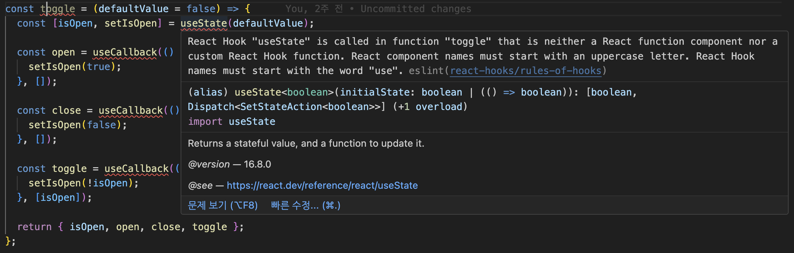

> ## 사내 리액트 스터디
>
> 주 제 : 모던 리액트 Deep Dive
>
> 인 원 : 3명
>
> 기 간 : 3월 28일 ~
>
> 진 행 : 4월 17일

## 리액트에서 재사용할 수 있는 로직을 관리하는 두 가지 방법

### 1. 사용자 정의 훅

### 2. 고차 컴포넌트

## 사용자 정의 훅 custom hook

서로 다른 컴포넌트 내부에서 같은 로직을 공유하고자 할때 사용한다.

```tsx
const useToggle = (defaultValue = false) => {
  const [isOpen, setIsOpen] = useState(defaultValue);

  const open = useCallback(() => {
    setIsOpen(true);
  }, []);

  const close = useCallback(() => {
    setIsOpen(false);
  }, []);

  const toggle = useCallback(() => {
    setIsOpen(!isOpen);
  }, [isOpen]);

  return { isOpen, open, close, toggle };
};
```

### 예를들어 위와 같은 코드가 커스텀 훅으로 작성되지 않았다면

toggle을 사용하는 컴포넌트마다 상태를 선언해서 사용했을것

### 커스텀 훅은 반드시 use~라는 네임규칙을 따라야한다.



### react-hooks/rules-of-hooks 경고를 제거하는 방법

1. Toggle 로 바꾸어 함수 컴포넌트로 알리는 방법
2. use를 붙여서 사용자 정의 훅이라고 알리는 방법

## 고차 컴포넌트 Higher Order Component

컴포넌트 자체의 로직을 재사용하기 위한 방법

### 리액트가 아니어도 사용할 수 있는 패턴

자바스크립트의 일급객체, 함수의 특징을 이용한다.

> ### “고차함수” - 고차 컴포넌트와 비슷하다
>
> 함수를 인수로 받거나 결과로 반환하는 함수
>
> ```jsx
> const list = [1, 2, 3];
> const doubledList = list.map((item) => item * 2);
> ```
>
> 여기서 map이 고차 함수이다.
>
> (item) => item \* 2 라는 함수를 인수로 받는다.

### 리액트에서는 “고차 컴포넌트”

컴포넌트를 인수로 받으며 컴포넌트를 반환한다.

```jsx
const withLoginComponent<T> = (Component: ComponentType<T>) => {
	return function (props: T & LoginProps) {
		const { loginRequired, ...restProps } = props

		if (loginRequired) {
			return <>로그인이 필요합니다.<>
		}

		return <Component {...(restProps as T)} />
	}
}

const Component = withLoginComponent((props: { value: string }) => {
	return <h3>{props.value}</h3>
})

export default function App() {
	const isLogin = false
	return <Component value="text" loginRequired={isLogin} />
}
```

### 컴포넌트 결과물에 영향을 미칠 수 있는 다른 공통된 작업을 처리 할 수 있다.

```jsx
		if (loginRequired) {
			return <>로그인이 필요합니다.<>
		}

		return <Component {...(restProps as T)} />
```

### 주의할점 1 : 고차 컴포넌트의 경우는 with~으로 시작해야한다.

eslint 규칙으로 강제되는 사항은 아니지만 통상적인 코딩규칙

### 주의할점 2 : 부수 효과를 최소화해야한다.

고차 컴포넌트는 반드시 컴포넌트를 인수로 받게 되는데

컴포넌트의 props를 임의로 수정하거나 조정하는 일은 없어야한다.

고차 컴포넌트를 쓸때 props가 수정될지도 모른다는 우려를 가지고 개발해야하기 때문이다.

### 주의할점 3 : 고차 컴포넌트를 중첩해서 사용하는 것을 최소화해야한다.

결국 컴포넌트를 바꾸는 컴포넌트이고

여러개를 중첩해서 사용할 경우 결과가 어떻게 바뀔지 예측하기 어렵기 때문이다.

## 정리

> 리액트에서 로직이 중복될때 사용자 정의 훅을 통해서 코드를 재사용 할 수 있다.
>
> 컴포넌트 자체의 로직을 재사용할때는 고차 컴포넌트를 사용한다.
>
> 네이밍 규칙으로 사용자 정의 훅은 'use~'가 붙고 고차 컴포넌트는 'with~'이 붙는다.
>
> 둘다 공통된 로직을 재사용하기 위해서 사용되며, 로직의 결과로 컴포넌트가 바뀔때에는 고차 컴포넌트를 사용한다.
