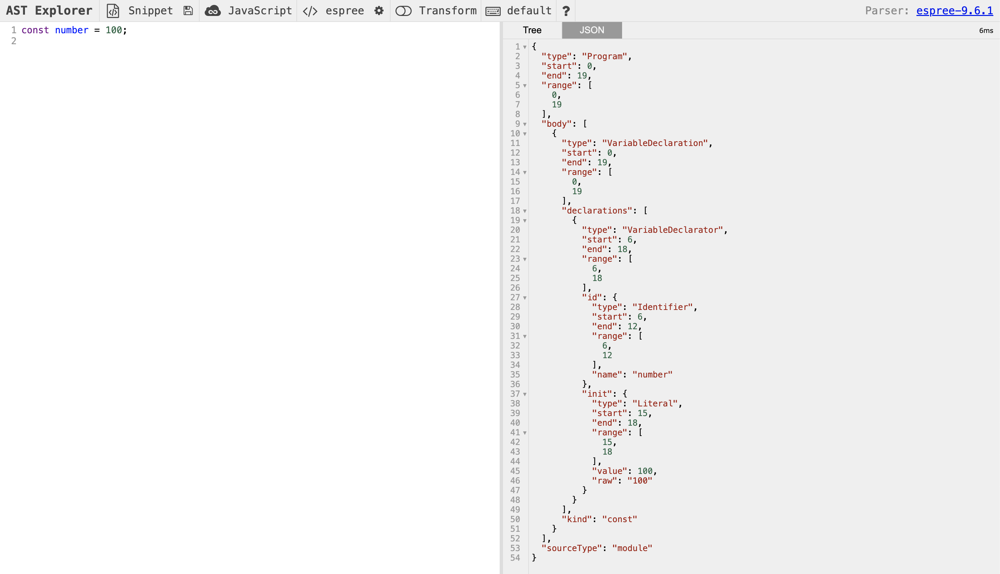
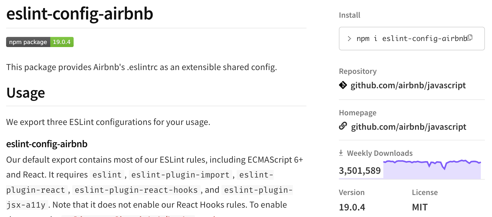
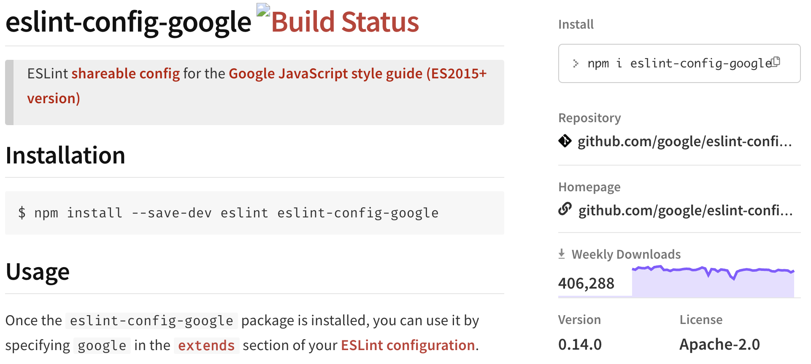
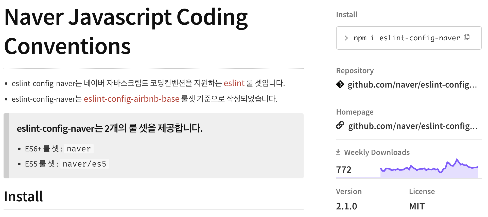
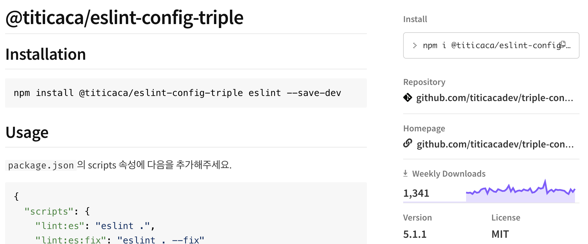
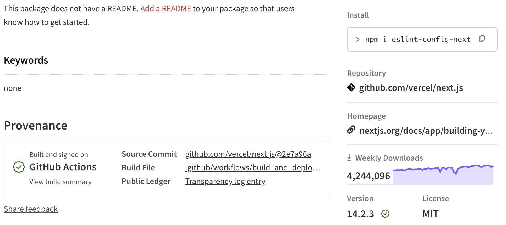
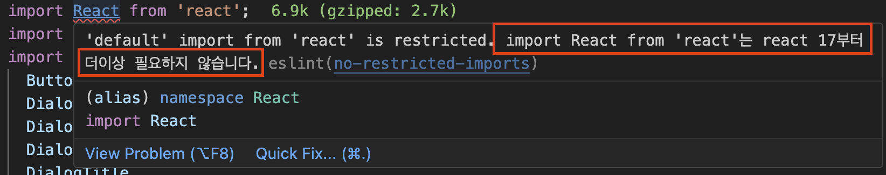

개발자들은 항상 예기치 못한 동작과 마주한다.

이런 동작을 방지하기 위한 방법으로 가장 빠르게 시도해 볼 수 있는건

바로 정적 코드 분석이다.

### 정적 코드 분석

정적 코드 분석이란, 코드의 실행과는 별개로 코드 그자체만으로 코드 스멜(잠재적으로 버그를 야기할 수 있는 코드)을 찾아내어 문제의 소지가 있는 코드를 사전에 수정하는 것이다.

자바스크립트 생태계에서 가장 많이 사용되는 정적 코드 분석도구는 ESLint이다.

### ESLint

자바 스크립트 코드를 정적 분석하고 문제를 발견하고 수정까지 도와준다.

동작 과정

1. 자바스크립트 코드를 문자열로 읽는다.
2. 분석할 수 있는 파서(parser)로 코드를 구조화 한다.
3. 구조화한 트리를 AST(Abstract Syntax Tree)라 하고 이를 규칙과 대조한다.
4. 위반한 코드에 대해서 Report 혹은 Fix한다.

이때, 자바스크립트를 분석할때 ESLint는 [espree](https://astexplorer.net/)라는 파서를 사용한다.



espree라는 코드 분석도구에서는 단순히 이 코드가 나타내는것이 함수인지, 함수명은 무엇인지 등만 파악하는 것이 아니라 코드의 위치와 순서등까지 자세하게 분석해 알려준다.

이러한 분석을 토대로 ESLint나 Prettier가 줄바꿈등까지도 파악할 수 있게 된다.

타입스크립트의 경우는 `@typescript-eslint/typescript-estree` 가 있다.

## eslint-plugin과 eslint-config

### eslint-plugin

린트 규칙을 모아놓은 패키지이다.

예를들어 eslint-plugin-react가 제공하는 규칙 중하나는 [react/jsx-key](https://github.com/jsx-eslint/eslint-plugin-react/blob/master/docs/rules/jsx-key.md) 라는 것이 있다.

이는 **iterators에서는 key를 무조건 포함해야한다**는 규칙인데

코드 정적 분석 도구라서 key가 유니크한 값인지까지는 확인해줄수 없지만 존재 여부만 확인해도 큰 도움을 받을 수 있다.

### eslint-config

eslint-plugin이 규칙들을 모아놓은 패키지라면, eslint-config는 이러한 eslint-plugin을 한데 묶어서 한 세트로 제공하는 패키지이다.

이해하기로는 eslint-plugin은 규칙의 분류같은 느낌이고 eslint-config는 최종적으로 사용하기 위한 패키지 같은 느낌이다.

eslint-config와 eslint-plugin의 네이밍 규칙이 있는데 반드시 한단어로 구성해야한다.

예를들어 eslint-config-google은 가능하지만 eslint-config-google-play는 불가능하다.

단, 특정 스코프가 붙는건 가능하다. `@titicaca/eslint-config-triple`

eslint-config를 만드는 것은 굉장히 번거로운 일이기 때문에 개인 개발자가 만들기보다 일부 IT기업들에서 잘 만들어진 규칙을 가져다 쓰는것이 일반적이다.

### eslint-config-airbnb

eslint-config를 선택한다고 가장했을때 가장먼저 고려되는 대상이다. 그만큼 많은 다운로드수를 자랑하고 에어비앤비 개발자뿐 아니라 500여명의 수많은 개발자들이 유지보수를 하고 있다.

Airbnb



Google



Naver



### @titicaca/triple-config-kit

한국 커뮤니티에서 운영되는 eslint-config중 유지보수가 활발한 편이다.

스타트업 개발사인 트리플(현 인터파크트리플)에서 개발하고 있고 꾸준히 업데이트중이다.



대부분의 eslint-config는 airbnb기반하여 약간의 룰만 수정한 수준에 그치지만 이 패키지는 자체적으로 정의한 규칙을 기반으로 운영되고 있다.

airbnb를 기반하지는 않지만 개발자들 사이에서 널리알려진 규칙은 모두 제공하고 있다.

### eslint-config-next



Next 프레임워크를 사용하게 되면 기본적으로 추가가 된다.

이 패키지는 단순히 자바스크립트 코드를 정적으로 코드를 분석할 뿐아니라 JSX 구문 및 \_app, \_document에서 작성되어 있는 HTML 코드또한 같이 분석해준다.

따라서 전반적인 웹 성능 향상에 도움을 준다.

## 나만의 ESLint 규칙 만들기

### 이미 있는 규칙 커스텀하기 : Import React를 제거해보자

예를들어 리액트 17버전이후에서는 이제 더이상

```jsx
import React from "react";
```

가 필요하지 않다.

웹팩에서 제공하는 트리쉐이킹 기능이 사용하지 않는 코드를 모두 삭제하기 때문에 빌드되는 파일 크기는 동일하지만, 이마저도 제거할 경우 웹팩이 트리쉐이킹하는 데 걸리는 시간을 그만큼 줄일 수 있기 때문에 빌드 속도가 빨라진다.

이미 있는 규칙을 수정하여 원하는 바를 달성해보자

no-restricted-imports라는 규칙은 어떤 모듈을 금지하기 위해 만들어진 규칙이다. 이것을 수정하여 원하는 목적을 달성할 것이다.

우리가 금지시킬 모듈은 react이고 그중에서도 default export만 금지시켜야한다.

그래야

```jsx
import { useState } from "react";
```

와 같은 것의 금지를 막고 필요한 부분만 금지가 된다.

```jsx
module.exports = {
  rules: {
    "no-restricted-imports": [
      "error",
      {
        paths: [
          {
            name: "react",
            importNames: ["default"],
            message:
              "import React from 'react'는 react 17부터 더이상 필요하지 않습니다.",
          },
        ],
      },
    ],
  },
};
```



설정한 메세지가 잘 나타남을 확인할 수 있다.

### 완전히 새로운 규칙 만들기 : new Date() 금지시키는 규칙

자바스크립트 환경에서는 현재 시간을 알기위해 `new Date()`를 쓰고는 한다.

혹은 현재 시간과 비교하여 기한의 마감을 설정하기도 한다. 이때 `new Date()`는 기기에 종속된 현재 시간으로 기기 시간을 바꿔버리면 `new Date()`가 반환하는 현재 시간 또한 변경된다.

하지만 분명히 할것은, `new Date()`만 금지시키고 `new Date(’2024-05-05’)`와 같은 Date 객체를 활용하는 경우는 금지시키면 안된다.

위의 요구사항을 반영한 규칙을 직접 만들어보자

1. new Date()를 espree로 분석해 만든 AST

```jsx
{
  "type": "Program",
  "start": 0,
  "end": 10,
  "range": [
    0,
    10
  ],
  "body": [
    {
      "type": "ExpressionStatement",
      "start": 0,
      "end": 10,
      "range": [
        0,
        10
      ],
      "expression": {
        "type": "NewExpression",
        "start": 0,
        "end": 10,
        "range": [
          0,
          10
        ],
        "callee": {
          "type": "Identifier",
          "start": 4,
          "end": 8,
          "range": [
            4,
            8
          ],
          "name": "Date"
        },
        "arguments": []
      }
    }
  ],
  "sourceType": "module"
}
```

여기서 살펴보아야할 부분은

- 생성자(new)를 사용해 만들었기에 표현타입이 NewExpression이다.
- callee에서 name은 Date이다.
- arguments가 빈배열인데 이는 인자로 아무것도 넘기지 않았기 때문이다.

세개를 만족하는 규칙을 작성해보자

```jsx
/**
 * @type {import('eslint').Rule.RuleModule}
 */

module.exports = {
  meta: {
    type: "suggestion",
    docs: {
      description: "disallow use of the new Date()",
      recommend: false,
    },
    fixable: "code",
    schema: [],
    messages: {
      message:
        "new Date()는 클라이언트에서 실행 시 해당 기기의 시간에 의존적이라 정확하지 않습니다.",
    },
  },
  create: function (context) {
    return {
      NewExpression: function (node) {
        if (node.callee.name === "Date" && node.arguments.length === 0) {
          context.report({
            node: node,
            messageId: "message",
            fix: function (fixer) {
              return fixer.replaceText(node, "ServerDate()");
            },
          });
        }
      },
    };
  },
};
```

```jsx
  "plugins": ["seung"],
  "rules": {
    "no-unused-vars": "off",
    "@typescript-eslint/no-unused-vars": ["error"],
    "seung/no-new-date": 2
  },
```

위 예시를 통해 나만의 eslint를 만들어보았다. 일명 [eslint-plugin-seung](https://www.npmjs.com/package/eslint-plugin-seung)!


아주 잘 동작한다 !

## ESLint를 사용할때 주의할점

### Prettier와의 충돌이 발생할 수 있다.

서로 충돌이 되지 않게 잘 선언하거나

자바스크립트, 타입스크립트는 ESLint에서 관리하고 그 외의 파일(마크다운, YAML, JSON 등)은 모두 Prettier에서 관리하는 방법이 있다.

그 대신 자바스크립트에서 필요한 prettier 규칙이 있을 수 있는데, eslint-config-prettier를 사용한다.

이것은 prettier에서 제공하는 모든 규칙을 eslint에서 사용할 수 있는 규칙으로 만들어둔 플러그인이다.

### 규칙에 대한 예외처리

eslint-disable- ~을 사용하면 예외처리가 가능하다.

```jsx
// 해당하는 줄 제외
console.log("안녕하세요"); // eslint-disable-line no-console

// 다음줄 제외
// eslint-disable-next-line no console
console.log("안녕하세요");

// 제외했다가 다시 적용
/* eslint-disable no console */
console.log("안녕하세요");
console.log("안녕히 계세요");
/* eslint-enable no console */

// 제외, 주로 파일 전체에 제외하는 경우 사용
/* eslint-disable no console */
console.log("안녕하세요");
```

## 정리

> ESLint은 자바스크립트 정적 분석도이다.
>
> eslint plugin과 config가 있는데 plugin은 규칙들을 모아놓은 것이고 config는 plugin을 모아둔것이다.
>
> 나만의 ESLint를 만들때에는 보통 파서에 의해 분석된 코드를 보고 규칙을 만든다.
>
> 주로 자바스크립트쪽은 ESLint가, 그 외 마크다운 쪽은 prettier가 도맡는다. 자바스크립트쪽 포맷팅은 eslint-config-prettier를 이용한다.
