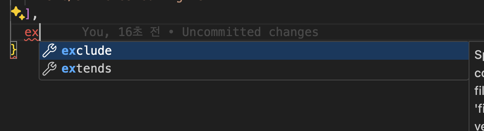
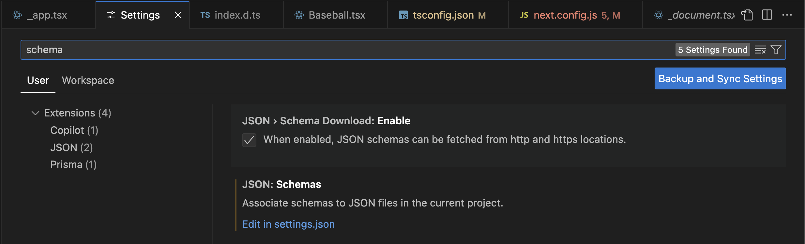

### [공부자료 : 모던 리액트 Deep Dive - 김용찬](https://yceffort.kr/2023/10/react-deep-dive)

## 도입

프로젝트를 새로 만들때 보통 create-react-app 혹은 create-next-app을 사용한다.

cra라는 편리한 마법에 빠져서 개발자는 cra가 어떠한 세팅을 해주는지 알지 못할때가 많다.

또한 create-react-app은 더이상 유지보수되지 않을 가능성이 크다.

[관련한 이슈](https://github.com/reactjs/react.dev/pull/5487#issuecomment-1409720741)

<br/>

> 요약
>
> CRA로는 최근 중요해진 ssr등을 지원할 수 없습니다. 그래서 리액트 팀에서는 여러 옵션을 고려중입니다.
>
> - 새로운 프레임워크를 만드는것
>   - 데이터 가져오기, 라우팅, 번들링 및 SSG/SSR을 통합하는 프레임워크로 Create React App을 다시 설계할 수 있습니다.
> - CRA를 중지하고 vite 템플릿만 유지하는것
> - CRA를 프레임워크 추천도구로 전환하는것
>
> 가장 유력한 옵션은 CRA를 프레임워크 추천도구로 전환하는것입니다.
>
> 이는 기존 워크플로우를 사용할 수 있으면서 새로운 옵션도 고려할 수 있습니다.
>
> 그래서 리액트 팀에서는 추천 프레임워크 목록을 만들고 유지보수 할 것입니다.
>
> → 따라서 미래의 CRA는 리액트 어플리케이션을 만드는 보일러플레이트 CLI가 아니라 리액트 기반 프레임워크를 제안하는 런쳐형태로 변경될 예정이다.

그래서 이 챕터에서는 cra를 쓰지 않고 개발환경을 구축하는 것에 대해 알아본다.

## create-next-app 없이 하나씩 구축하기

1. npm init을 통해 package.json을 만드는 CLI를 실행한다.

```shell
npm init
```

(이것도 스스로 파일을 만들 수 있다.)

필요정보를 입력하게 되면 package name, version, lincense 등의 정보가 적힌 package.json이 생긴다.

1. Nextjs 프로젝트를 실행하는데 필수적인 라이브러리를 설치한다.

```shell
npm i react react-dom next
```

1. devDependencies에 필요한 패키지를 설치한다.

```shell
npm i @types/react @types/node @types/react-dom --save-dev

npm i eslint eslint-config-next typescript --save-dev
```

타입스크립트, 리액트 타입지원에 필요한것들과 ESLint 사용에 필요한 패키지들을 설치한다.

## tsconfig.json 작성하기

npm 설정을 package.json에서 한다면, 타입스크립트 설정은 tsconfig.json에서 한다.

JSON 최상단에 다음과 같이 입력한다.

```jsx
{
	"$schema": "https://json.schemastore.org/tsconfig.json"
}
```

위 코드를 입력하게되면,



schemastore에서 제공해주는 정보를 통해 IDE에서 자동완성이 가능해진다.



요즘에는 vscode의 옵션으로 들어가서 따로 지정하지 않아도 된다.

아래는 tsconfig에 대한 설정들 설명이다.

프로젝트에 필요한 설정들을 추가하면 된다.

```json
// tsconfig.json
{
  // 타입스크립트가 자바스크립트로 컴파일할 때 사용하는 옵션
  "compilerOptions": {
    "target": "es5",
    // 타입스크립트가 변환을 목표로 하는 버전이다.
    // 예를들어, es5로 되어있는데 es6의 화살표함수는 지원하지 않아 일반함수로 변환될 것이다.
    // 폴리필까지는 지원하지 않는다.

    "lib": ["dom", "dom.iterable", "esnext"],
    // 가장 최신을 뜻하는 esnext를 넣게 되면 target이 구버전이라도
    // 신버전의 문법을 사용하는것에 에러를 발생시키지 않는다.

    "allowJs": true,
    // 타입스크립트가 자바스크립트 파일또한 컴파일할지 결정한다.
    // 주로 ts와 js 파일이 혼재되었을때 사용하는 옵션이다.

    "skipLibCheck": true,
    // 라이브러리의 타입정보를 가지고 있는 d.ts는 검사하지 않겠다는 옵션이다.

    "strict": true,
    // 타입스크립트 컴파일러의 엄격모드이다. 이 옵션을 키면 다음 옵션도 함께 켜진다.
    // 1. alwaysStrict : 모든 자바스크립트 파일에 use strict를 추가한다.
    // 2. strictNullChecks : 엄격한 null 검사를 활성화한다.
    // 3. strictBindCallApply : call, bind, apply에 대해서 정확한 인수를 요구한다.
    //     원래는 주어진 인수의 개수보다 넘치더라도 자동으로 무시한다.
    // 4. strictFunctionType : 함수 타입에 대해 엄격함을 유지한다.
    // 5. strictPropertyInitialization : 프로퍼티에 값을 할당할때 타입이 올바르지 않으면 에러
    // 6. noImplicitAny : 타입을 명시하지 않은 변수에 자동으로 any를 할당하지 않고 에러
    // 7. noImplicitThis : this를 추론할 수 없는 상황에서 any를 할당하지 않고 에러
    // 8. useUnknownInCatchVariables : catch 구문에서 잡은 변수는 unknown을 할당한다.

    "forceConsistentCasingInFileNames": true,
    // 파일 이름의 대소문자를 구분하도록 한다.
    // SignUp하고 Signup은 다른 파일로 구분한다.

    "noEmit": true,
    // 컴파일하지 않고 타입만 체크한다.
    // next에서는 swc라는 러스트 기반 컴파일러가 있는데 타입스크립트 대비 월등히 빠른속도로 컴파일한다.
    // swc가 타입스크립트 파일을 컴파일 하므로 타입스크립트가 자바스크립트로 컴파일할 필요가 없다.

    "esModuleInterop": true,
    // CommonJS방식으로 보낸 모듈을 ES 모듈 방식의 import로 가져올 수 있게 한다.

    "module": "esnext",
    // commonjs는 repuire를 사용하고 esnext는 import를 사용한다.

    "moduleResolution": "node",
    // 모듈을 해석하는 방식이다.
    // node는 node_modules를 기준으로 해석하고,
    // classic는 tsconfig.json이 있는 디렉토리 기준으로 해석한다.

    "resolveJsonModule": true,
    // JSON 파일을 import할 수 있게 해준다.

    "isolatedModules": true,
    // 파일에 importSK export가 없다면 단순 스크립트 파일로 인식해 이러한 파일이 생성되지 않도록 한다.
    // 다른 모듈시스템과 연계되지않고 단독으로 있는 파일의 생성을 막기 위한 옵션이다.

    "jsx": "preserve",
    // tsx 내부에 있는 jsx를 어떻게 컴파일할지 결정한다.
    // react : 기본값이고, React.createElement로 변환한다.
    // preserve : 변환하지 않고 그대로 유지한다. -> swc가 jsx 또한 변환해준다.

    "incremental": true,
    // 마지막 컴파일 정보를 .tsbuildinfo 파일 형태로 만들어 저장한다.
    // 다시 컴파일러가 호출되었을때, 파일을 토대로 가장 비용이 적게 드는 방식으로 컴파일을 수행한다.

    "baseUrl": ".",
    // 기준이 되는 디렉토리
    "rootDir": ".",

    "paths": {
      "#atoms/*": ["components/atoms/*"]
    },
    // 상대경로나 절대경로가 길게 있을경우 간단하게 표현이 가능하다.

    "downlevelIteration": true,
    // TypeScript가 for...of, spread 연산자(...), 배열 및
    // 이터러블 객체의 destructuring assignment 등의 이터레이션 기능을 컴파일할 때,
    // ES5와 같은 하위 버전의 JavaScript에서도 동작하도록 코드를 변환한다.
    // 즉, 더 낮은 버전에서도 동작하게끔 더 복잡하게 변환하는 옵션이다.

    "allowImportingTsExtensions": true
    // TypeScript 모듈 시스템에서 파일을 가져올 때,
    // TypeScript 파일 확장자(.ts나 .tsx)를 포함하여 가져오는 것을 허용한다.
    // 기본적으로는 생략하는데 표기하는것도 허용하는 옵션이다.
  },
  "include": [
    "next-env.d.ts",
    "**/*.ts",
    "**/*.tsx",
    "instrumentation.node.ts",
    "instrumentation.ts"
  ],
  // 타입스크립트 컴파일 대상에서 포함시킬 파일 목록
  "exclude": ["node_modules"]
  // 타입스크립트 컴파일 대상에서 제외시킬 파일 목록
}
```

## next.config.js 작성하기

어떤 옵션이 가능한지에 대해서는 next버전에 맞게

[/packages/next/server/config-shared.ts](https://github.com/vercel/next.js/blob/v12.2.0/packages/next/server/config-shared.ts)에서 확인이 가능하다.

세가지만 간단하게 알아보자.

- reactStrictMode : 리액트의 엄격모드를 활성화한다.

- poweredByHeader : 일반적으로 보안 취약점으로 취급되는 X-Powered-By 헤더를 제거한다.

- eslint.ignoreDuringBuilds : 빌드시에 eslint를 무시하고, CI 과정에서 별도로 작동하게 만들어 빌드를 더욱 빠르게 만든다. → 커밋시 자동으로 실행하도록 하거나 별도의 트리거를 만든다.

## ESLint와 Prettier 설정하기

앞서 추가한 eslint, eslint-config-next로는 부족하다.

코드의 잠재적인 문제만 해결했을뿐, 띄어쓰기나 줄바꿈 같은 코드 스타일링이 필요하다.

추가로 스타일링에 맞는 패키지를 추가한다.

```shell
npm i @titicaca/eslint-config-triple
```

eslint-config-next 와 eslint-config-triple이 함께 동작하게 하려면 추가 설정이 필요하다.

```jsx
const path = require("path");

const createConfig = require("@titicaca/eslint-config-triple/create-config");

const { extends: extendConfigs, overrides } = createConfig({
  type: "frontend",
  project: path.resolve(__dirname, "./tsconfig.json"),
});

modules.exports = {
  extends: [...extendConfigs, "next/core-web-vitals"],
  overrides,
};
```

위와 같이 extends에 ‘next/core-web-vitals’를 추가하면 두개 설정이 모두 적용된다.

## 스타일 설정하기

next.config.js에 styledComponents: true 를 추가하면

swc 가 styled-components를 사용하는 코드를 더 빠르게 변환한다.

> SWC란
>
> - SWC는 "Speedy Web Compiler"를 의미한다.
>
> - SWC는 Rust로 작성된 매우 빠른 JavaScript/TypeScript 컴파일러이자 번들러이다.
>
> - 트랜스파일링, 번들링, 압축, 플러그인 시스템 등을 지원한다.
>
> - Rust를 통해 작성되어 기존 Javascript 컴파일러보다 훨씬 빠른 성능을 자랑하여 빌드 시간을 크게 줄인다.
>
> - Typescript도 지원하여 빠른 빌드를 제공한다.

## 정리

요즘은 마이크로 프론트엔드를 지향하여 새로운 프로젝트를 구축하는 일이 비교적 잦다.

이럴때 cra말고 초기에 프로젝트를 구축하는 방법은 두가지가 있는데,

1. 보일러 플레이트 프로젝트를 만든다음 Template repository 옵션을 체크해두고 새로 구축하는 프로젝트마다해당 프로젝트를 선택하여 그 기반에서 생성한다.
2. 나만의 create-seung-app을 만든다.
   1. create-next-app https://github.com/vercel/next.js/tree/canary/packages/create-next-app
   2. npm 기반하여 CLI 패키지 만들기 https://blog.logrocket.com/creating-a-cli-tool-with-node-js/
   3. 위 두개를 참고하여 직접 구현해보자
