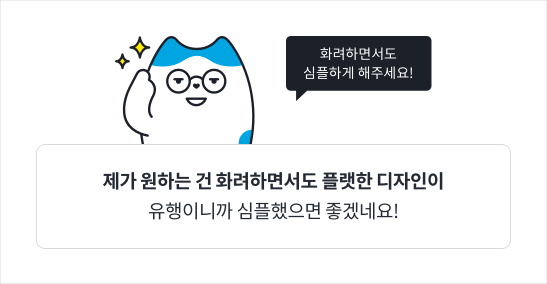
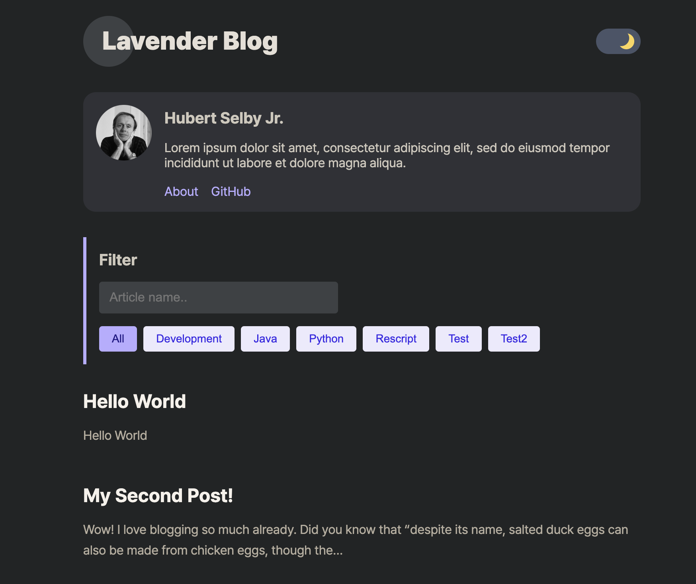
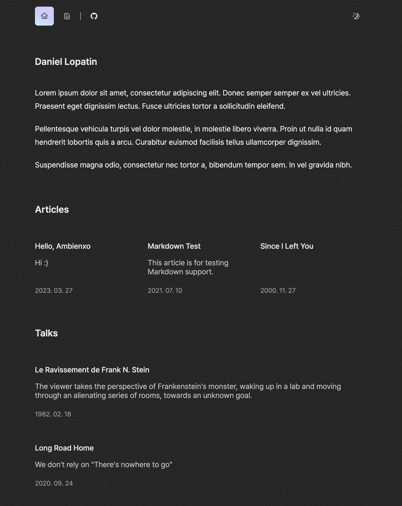

## 블로그를 드디어 시작했다

해야지 해야지 생각만하다가 못한게 벌써 1년정도 지났다.

그동안 쉽게 시작을 하지 못했던건 환상 같은게 있었다.

이왕하는거 남들과는 다르게 하고 싶었고

<u>예뻤으면</u> 좋겠고

그렇지만 <u>검색어에도 자주 노출</u>되었으면 좋겠고

남들이 많이봐서 <u>광고도 달아서 수익도</u> 났으면 좋겠고

<u>그럼에도 예뻤으면</u> 좋겠고

#### 그래서 시작하지 못했다.

아니 이왕하는거 제대로 하고싶잖아?

사실 그동안 2번의 기술블로그가 있었다.

tistory -> velog를 거쳐 다 맘에 안들어서 지우고 여기에 종착..

## 탬플릿으로 쉽게 개발하자

이런 나를 만족시킨건 탬플릿이었다.

여러 아티클을 찾아보던중

[오종택 개발자님의 기술블로그](https://saengmotmi.netlify.app/)를 보게되었고

정말 깔끔하고 필요한 기능만 갖추고 있었다.

어떻게 구현하셨을까?

**그건 바로바로~~** [탬플릿](https://gatsby-starter-lavender.vercel.app)을 이용하셨다는 사실을 알게되었다.

나도 이걸 보면서

여기에 커스텀만 살짝 첨가해서 진짜 내 블로그를 만들면 좋겠다 싶었다.

다 만들고나서 알게된 사실은,

[탬플릿을 개발하신 분](https://github.com/blurfx)께서 [다른 탬플릿](https://ambienxo.vercel.app)도 만드셔서 여러개 중에서 선택할 수 있었는데 살짝 아쉽다.

디자이너도 아니고 너무 미적인 부분에 치우쳐져있어서 정말 중요한 본질인 "기록하는 것"을 계속 오랜시간 놓치고 말았다.

이제 탄력받아서 열심히 쓸것이야

근데 탬플릿 그대로 쓰기에는 맘에 안들어서 투두를 적어보았다.

## 더 친절한 블로그를 위한 TODO

1. 댓글 부분 대대적인 개편

- 깃허브 이슈와 연동되어있어 좋은점도 있지만, 커스텀에 한계가 있고 좀더 자유롭고 재밌는 방법이 있을거 같다.

2. 글 리스트에서 썸네일, 날짜, 태그 보이게 레이아웃 수정하기

- 내 블로그에 처음 들어오는 사람이 티클과 같은 일상글을 먼저 접하는게 안좋다고 생각했다.
- 그래서 메인탭을 새로 만들었는데 최선은 아닌듯하다. 해시태그를 추후에 추가할 예정이고 .. 메인에 보여질 컨텐츠나, 레이아웃 등은 더 고민이 필요한거같다..

3. 날짜순이 아니라 지정하는 순서대로 리스트 보이게 하기

- 이건 과거에 진행했고 노션에 개인적으로 기록해 놓은 스터디 때문이다! 옮길 예정이기 때문!

4. 글 하단에 우측글, 좌측글 이동하는 부분 좀더 직관적으로 수정하기

- 별로 누르고 싶은 생각이 안든다.
- 누르고 싶은 생각이 들게 형태도 바꾸고 싶다.

5. 글 하단에서 최상단으로 이동하는 버튼 혹은 블로그 제목은 상단 고정

6. 넓은 화면에서는 목차가 우측에 스크롤 따라다니게 수정하기

7. 거슬리지 않는 선에서 구글 애드센스 추가하기

8. 태그마다 상단에 설명부분 추가하기

9. 작성중 상태 추가 - 클릭못하게하거나 변경될수있음 안내고려

10. 일주일내로 업로드된 글에 대해서는 NEW 뱃지 추가하기

11. 스터디한 내용의 경우 마지막에 개념 확인용 퀴즈 추가

12. 블로그 스타일을 전체적으로 음악 재생바, pip, 재생목록

 

---

gatsby에 graphql이라서 너무 구조가 생소하다. 수정하는게 쉽지않을 듯하다.
