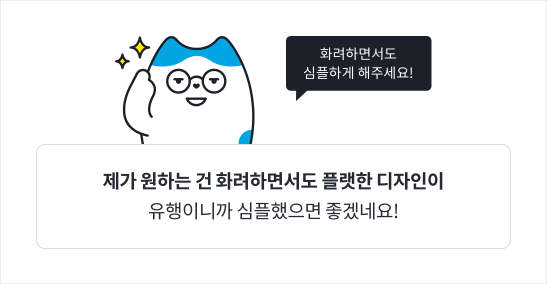
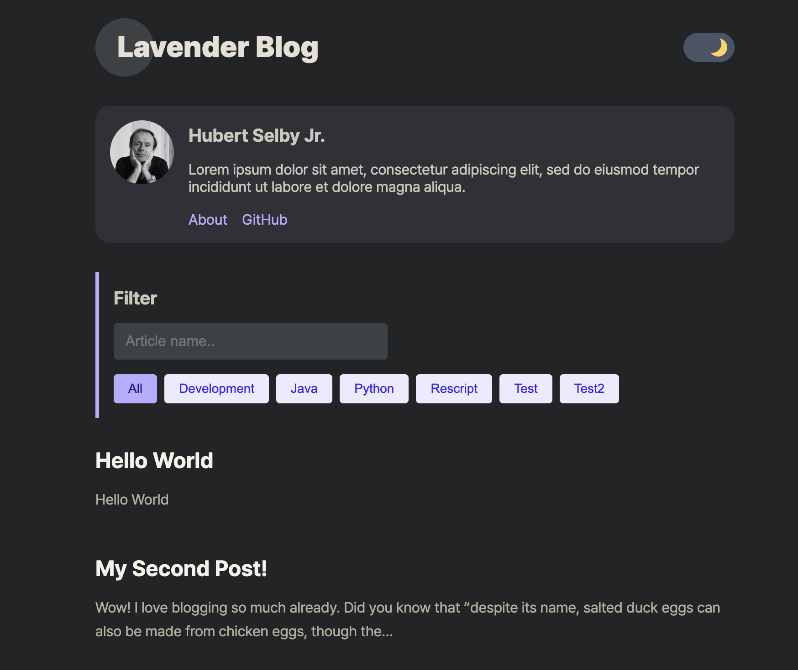
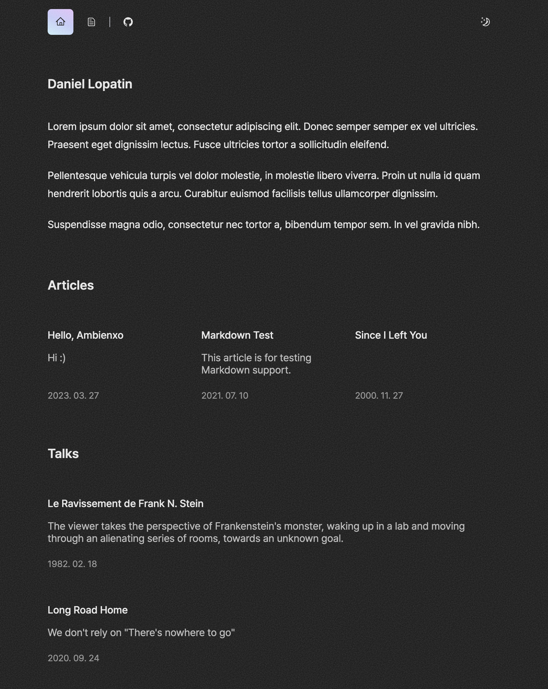

## 블로그를 드디어 시작했다

해야지.. 해야지.. 생각만하다가 못한게 벌써 1년정도 지났다.

그동안 쉽게 시작을 하지 못했던건 **기술 블로그에 대한 환상** 같은게 있었다.

이왕하는거 남들과는 다르게 하고 싶었고

<u>예뻤으면</u> 좋겠고

그러면서 <u>검색어에도 자주 노출</u>되었으면 좋겠고

남들이 많이봐서 <u>광고도 달아서 수익도</u> 났으면 좋겠고

<u>그럼에도 예뻤으면</u> 좋겠고

**그래서 시작하지 못했다.**

아니 이왕하는거 제대로 하고싶잖아?

사실 그동안 2번의 기술블로그가 있었다.

tistory -> velog를 거쳐 다 맘에 안들어서 지우고 여기에 종착..

## 탬플릿으로 쉽게 개발하자

이런 나를 만족시킨건 탬플릿이었다.

여러 아티클을 찾아보던중

[오종택 개발자님의 기술블로그](https://saengmotmi.netlify.app/)를 보게되었고

기술블로그의 [탬플릿](https://gatsby-starter-lavender.vercel.app)이 있다는 사실을 알게되었다.

마치 나처럼 더 잘 만들기위해 평생 시작하지 못하는 사람들을 위한..ㅋㅋ

이 블로그의 기본 형태는 위와같다.

여기에 다른 블로그들을 보면서 느낀 불편한 점만 개선해서 나만의 블로그를 완성하려한다.

다 만들고나서 알게된 사실은,

[탬플릿을 개발하신 분](https://github.com/blurfx)께서 [다른 탬플릿](https://ambienxo.vercel.app)도 만드셔서 여러개 중에서 선택할 수 있었는데 살짝 아쉽다.

이제 시작했으니 이제 탄력받아서 열심히 쓸것이야

개선하고자하는 투두를 적어보았다.

## 더 친절한 블로그를 위한 TODO

1. 댓글 부분 대대적인 개편

- 깃허브 이슈와 연동되어있어 좋은 점도 있지만, 커스텀에 한계가 있고 좀 더 자유롭고 재밌게 독자가 의견을 남기는 방법이 있을거 같다.

2. 글 리스트에서 썸네일, 날짜, 태그 보이게 레이아웃 수정하기

- 블로그에 처음 들어오는 사람이 티클과 같은 일상글을 먼저 접하는게 안좋다고 생각했다. 그래도 정체성은 기술블로그이니 테크 지식이 담긴글을 메인에 오도록
- 그래서 메인탭을 새로 만들었는데 최선은 아닌듯하다. 해시태그를 추후에 추가할 예정이고 .. 메인에 보여질 컨텐츠나, 레이아웃 등은 더 고민이 필요한거같다

3. 날짜순이 아니라 지정하는 순서대로 리스트 보이게 하기

- 이건 과거에 진행했고 노션에 개인적으로 기록해 놓은 스터디 때문이다! 옮길 예정이기 때문!

4. 글 하단에 우측글, 좌측글 이동하는 부분 좀더 직관적으로 수정하기

- 별로 누르고 싶은 생각이 안든다.
- 누르고 싶은 생각이 들게 형태를 바꾸고 싶다.

5. 글 하단에서 최상단으로 이동하는 버튼 혹은 블로그 제목은 상단 고정

- 다른 블로그를 읽었을때 항상 느낀건, 더 읽을지 말지 판단은 처음에 결정난다.
- 결정하고 나서는 끝까지 읽게 되는데 일고 나서 재밌어서 다른 글을 읽으려고 위로가거나 메인으로 가는 버튼이 있었으면 좋겠다고 생각해왔다.

6. 넓은 화면에서는 목차가 우측에 스크롤 따라다니게 수정하기

7. 거슬리지 않는 선에서 구글 애드센스 추가하기

- 반려되었다. 아직 컨텐츠 부족인게 가장 큰 문제같다.

8. 태그마다 상단에 설명부분 추가하기

9. 작성중 상태 추가

- 클릭못하게하거나 변경될수있음 안내고려
- 개발자이므로 주석 느낌을 내었다.

10. 일주일내로 업로드된 글에 대해서는 NEW 뱃지 추가하기

11. 스터디한 내용의 경우 마지막에 개념 확인용 퀴즈 추가

12. 블로그 스타일을 전체적으로 음악 재생바, pip, 재생목록

## 여전한 고민

아직 고민이 완전히 해결되지 않았다.

첫번째 고민은 디자인적 요소였는데 탬플릿으로 어느정도 해결이 되었다.

두번째 고민은 수요다.

이왕 만든 블로그, 많은 사람들이 봐줬으면 좋겠다.

그런데 도대체 다른 사람이 내 블로그를 봐야할 이유가 없다.

> 나라도 내 블로그를 안볼게 될거같다.
>
> 글재주 없는 개발자가 지식전달 말고
>
> 다른식으로 블로그를 운영하는건 정말 불가능한걸까

컨텐츠에 대한 고민이 많다.

아직 이문제에 대한 해결책은 찾지 못했다.

이 블로그가 단지 나의 포트폴리오에만 머물지 않기를 바라는 마음이 크다.
