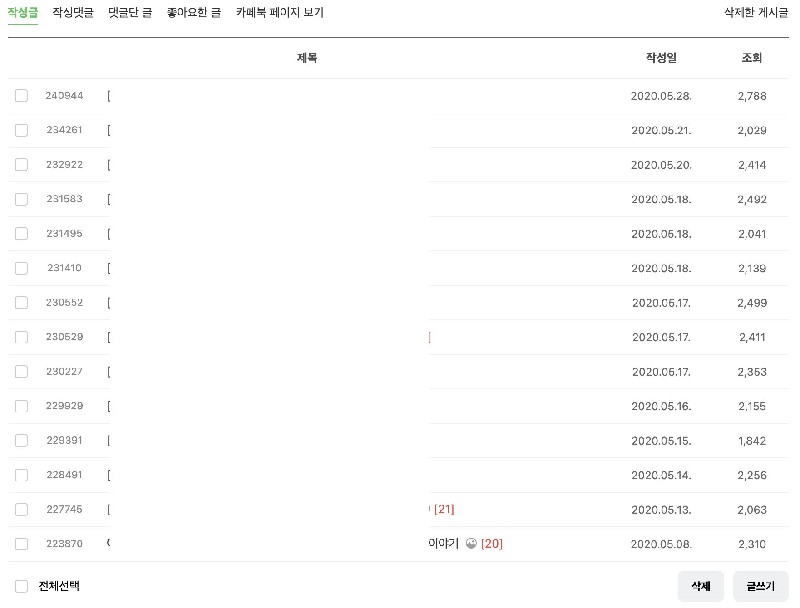

### 티클을 쓰기 시작했다.

 

~티끌 티클 오타 아니고 말장난입니다.~

아직 내공이 많이 부족하다.

쉽게 쓰고 싶은데 자꾸만 뭔가 거대해진다.

블로그 시작하는 것도 어려웠는데 글쓰는게 더 어렵다. 😥

구조를 짜고.. 차례를 구성하고.. 이미지 찾고.. 하지만 들인 노력대비 결과물의 완성도나 유익함은 떨어진다.

그래서 아티클의 미니 버전을 쓰기로 했다. <strong>이름하여 티클</strong>

회사다니면서 기록하고 싶은거나 다른 서비스를 이용하면서 알게된 인사이트를 쉽게 쉽게 쓸 예정

 

티끌을 모으면 언젠가 아티클을 쓸 수 있는 실력이 되지 않을까

오늘도 나는 티클을 모은다.

### 앞으로의 블로그 글 구조

총 5가지로 나누어 작성한다.

~아.. 또 거대해졌다. 그렇지만 최대한 줄인건데.~

> ### ticle

쉽게 쓸 수 있는 TIL하고,

다른 서비스, 기업에서 도입하고 있는 인사이트 있는 내용을 정리해서 남겨둘 예정

> ### studio

나는 현재 스튜디오에서 일하고 있다.

ㅋㅋ

이름은 바꿨으면 좋겠다.. 정말..

무튼 일하면서 마주하는 문제와 미숙한 해결과정에 대해 다뤄질 예정

> ### study

회사에서 동료들과 주 1회씩 하고 있는 스터디를 노션에 정리했었는데 여기로 차례차례 옮겨야겠다.

자바스크립트 딥다이브라는 책으로 시작하여 지금은 리액트 딥다이브로 넘어간 상태이다.

여기로 옮기는 겸 다시 복습도 !

스터디 글의 말미에는 퀴즈를 추가해서 점검할 수 있게 할 예정이다.

> ### project

졸업 프로젝트를 비롯하여

사이드 프로젝트에 대한 설명, 진행 히스토리, 기술적 어려움과 극복 등을 함께 다를것이다.

> ### article

결국 최종 목표는 아티클이다!

내가 팔로우하는 오종택 개발자님처럼 유려하게 적는것을 목표로..

아직은 티클을 좀 더 모아야한다..

다행히도 아예 글을 처음 적는건 아니라서

예전에 게임 카페에 글을 적어본 적이 있는데 조회수가 꽤 나왔다.

돈도 많이 쓰고 시간도 많이 뺏었던 애증의 라오킹.. 이게 도움이 될줄이야

 

#### 그때 내가 느낀 많은 조회수 꿀팁은

떠먹여줘야한다. <strong>떠서 읽어줘야 한다.</strong>

이해를 돕는 적절한 사진이 중간 중간 들어가줘야하고

가독성이 좋게 중간중간

줄바꿈이라든지, <strong>굵기 조절</strong>이라든지도 들어가야한다.

~이런 강약을 주는게 도움이 됐다.~

그리고 글이 길지 않으면서 말하고자 하는 내용이 명확해야했다.

가장 중요한건 <u>쓰고 싶은 글보다 <strong>읽고 싶은 글을 적어줘야 한다.</strong></u> 내 TMI를 최대한 빼자.

다 쓰고나서 여러번 읽어보면서, 막힘없이 술술 읽히도록 수정하는 과정도 필요했다.

> ### (번외) 블로그 스타일링

최근에는 블로그 스타일링에 더 관심이 생겨 큰일이다.

...이 직업병... 자꾸만 사용성 개선을 하고만 있다.

소문난 잔치에 먹을건 없고

잔치 장소로 오는 길만 편해지고 예뻐지고 있는 상태..

사실 소문도 안난 잔치.. 😃

회사에 다녀보니 사용하기 편한 서비스를 자주 이용하게 되더라.

 

#### 우선은 보기 좋게 만들고,

그 다음에는 좀 더 기교를 넣고 싶은데

혹시 [김종민 개발자님 블로그](https://blog.cmiscm.com/?page_id=5945)를 아시는가?

인터렉션을 아주 자유자재로 다루시는 분이다.

이 분처럼은 못하겠지만 조금씩 따라가볼 생각이다.

그냥 저분의 프로젝트를 보는 것만으로도 많은 영감이 떠오른다.

 

#### 예를들면, 내 블로그 상단에는 스크롤에 따라 진행바가 있는데

이게 마치 음악 재생이 되는 진행바와도 같아서 음악을 틀어놓은것처럼 재생바처럼 꾸민다든가

하는 여러 실험적인 아이디어를 구상중이다.

또한 pip같은것도 블로그에 도입해보고 싶다.

보통 영상만 pip모드가 지원되고 글이 pip가 되는건 보지 못했다. ~수요가 없기 때문인가~

내 블로그를 음악 듣는 사이트처럼 만들어보려 한다.

 

#### 궁극적으로는 독자와 함께 만들어가는 블로그를 만들고 싶었는데

독자가 참여한 것이 블로그에 반영되고 수정되려면

db가 필요하다... 그래서 거기 정보를 수정하고 불러오고를 해야하는데

이건 좀더 고려해봐야겠다.
