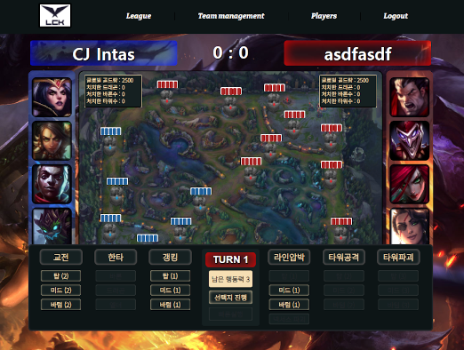

## 티클을 쓰기 시작했다.

아직 글쓰기 실력도, 개발실력도, 많이 부족하다.

그래서 아티클의 미니 버전을 쓰기로 했다. **이름하여 티클**

회사다니면서 기록하고 싶은거나

다른 서비스를 이용하면서 알게된 인사이트를 쉽게 쉽게 쓸 예정

 

티클을 모으면 언젠가 아티클을 쓸 수 있는 실력이 되지 않을까

## 앞으로의 블로그 글 구조

크게 5가지로 나누어봤다.

> ### \_talk

til보다 더 짧은 에피소드같은 느낌이다.

친구와 챗하듯 생각난 아이디어나 짧은 기록등이다.

깨달음없이도 인사이트도 포함이다.

> ### til

일하면서 얻은 짧은 깨달음을 쉽게 적기위한 글이다.

> ### ticle

사진도 첨부하며 긴 호흡으로 정리하는 깨달음이다.

til이 쇼츠라면 ticle은 풀영상이다.

여기에는 개발적 깨달음과 일정기간 회고를 포함한다.

> ### study

회사에서 동료들과 주 1회씩 하고 있는 스터디를 노션에 정리했었는데 여기로 차례차례 옮겨야겠다.

**자바스크립트 딥다이브**로 시작하여 지금은 **리액트 딥다이브**로 넘어간 상태이다.

여기로 옮기는 겸 다시 복습도 !

스터디 글의 말미에는 퀴즈를 추가해서 점검할 수 있게 할 예정이다.

> ### review

졸업 프로젝트를 비롯하여

진행한 사이드 프로젝트에 대한 회고이다.

지금의 내가 엄격하게 리뷰하는 경험을 가져보는건 어떤가 싶다.

과거의 나는 얼마나 엉망일것이고 지금의 나는 얼마나 성장했는가 궁금하다.

> ### (번외) 블로그 스타일링

최근에는 블로그 스타일링에 더 관심이 생겨 큰일이다.

...이 직업병... 자꾸만 사용성 개선을 하고만 있다.

소문난 잔치에 먹을건 없고

**잔치 장소로 오는 길만 편해지고 예뻐지고 있는 상태..**

사실 소문도 안난 잔치.. 😃

회사에 다녀보니 사용하기 편한 서비스를 자주 이용하게 되더라.

 

**우선은 보기 좋게 만들고,**

그 다음에는 좀 더 기교를 넣고 싶은데

혹시 [김종민 개발자님 블로그](https://blog.cmiscm.com/?page_id=5945)를 아시는가?

인터렉션을 아주 자유자재로 다루시는 분이다.

이 분처럼은 못하겠지만 조금씩 따라가볼 생각이다.

단지 저분의 프로젝트를 보는 것만으로도 많은 영감이 떠오른다.

 

**예를들면, 내 블로그 상단에는 스크롤에 따라 진행바가 있는데**

이게 마치 음악 재생이 되는 재생바와도 같아서

음악을 틀어놓은것처럼 진행바처럼 꾸민다든가

여러 실험적인 아이디어를 구상중이다.

또한 pip같은것도 블로그에 도입해보고 싶다.

보통 영상만 pip모드가 지원되고 글이 pip가 되는건 보지 못했다.

내 블로그를 음악 듣는 사이트처럼 만들어보려 한다.

## 궁극적으로는 함께 만들어가는 블로그

독자가 참여한 것이 블로그에 반영되고 수정되려면

db가 필요하다... 그래서 거기 정보를 수정하고 불러오고를 해야하는데

이건 좀 더 고려해봐야겠다.
