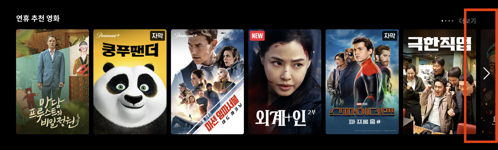

## PC와 모바일 웹은 같은 웹 개발이 아니었다

처음에는 간단히 반응형만 고려하였다.

사실 모바일은 그렇게까지 따로 고려하지 않았다.

"그냥 웹에서 innerWidth가 충분히 줄어들면 그게 모바일 화면이 되도록하자!"

그렇게 ui만 고려하게 되면 문제가 많이 발생한다.

예를들면 호버이벤트.. 마우스를 올려놓아야 발생하는데 모바일에서는 호버를 할 수 없다.

이처럼 ui말고도 기능적으로 모바일에서는 특히 다르게 적용해주어야하는 것들이 있다.

그래서 어떻게 다르게 나타내줄수 있는지 정리해보았다.

## 항상 나타내기 : 호버이벤트

유튜브의 영상카드에서는 케밥버튼이 있다.

`video: ./video1.mp4`

PC에서는 마우스를 가져다대면 나타나지만

모바일 웹에서는 호버이벤트를 충분히 활용하기 어렵다.

동일한 매커니즘을 그대로 적용하면 모바일에서는 케밥 버튼을 제공하지 않는다고 느낄수도 있다.

가장 쉽게 고려하는 방법은 항상 나타내는 방법이다.


이렇게 호버이벤트의 경우 모바일에서는 <u>**항상 나타내기**</u>로 대응이 가능하다.

## 핵심 개념만 유지하고 다르게 적용하기 : 포커싱

같은 호버이벤트에 대해서 <u>**항상 나타내기**</u>로 모든게 대응가능한건 아니다.

위와 비슷한 예시로 자동 재생 기능을 살펴보자.


PC에서는 hover 이벤트를 통해서 재생하도록 한다.

하지만 이걸 항상 나타내게 되면? 모든 영상이 재생중이게 될것이다.

유튜브의 대응 방식은 <u>**포커싱**</u>이라는 개념만 가져갔다.

PC에서의 포커싱은 **마우스 커서로 가리키게** 된다.

그럼 모바일에서는 ?

모바일은 화면 크기가 충분히 작으므로 **화면안에 들어온것**에 대해서

사용자가 포커싱하고 있다고 인지한다.

`video: ./video2.mp4`

그래서 유튜브에서는 화면안에 영상이 등장하면 자동으로 재생하도록 되어있다.

`IntersectionObserver`를 이용한것으로 예상되는데 정확한 로직은 알 수 없다.

## 보조 버튼 제공하기 : 좌우 스크롤

다른 예시를 살펴보자.

모바일에서 좌우 스크롤은 가볍게 터치로 가능하다.

하지만 PC에서는 마우스 휠로는 세로 스크롤이 더 익숙한데

그래서 가로 스크롤을 제공하기 위한 방법으로 주로 보조 버튼을 제공한다.



컨텐츠 리스트 우측부분에 **좌우 스크롤을 도와주는 보조 버튼**을 추가 하여 클릭하면 스크롤이 가능하다.

**마우스로 드래그하는 기능을 제공**하기도 한다.

이 경우는 앞선 경우와 다르게 모바일의 기능을 PC로 가져온 경우다.

## 모바일에서 기능 제한하기 : 3D 인테리어

모바일의 화면이 좁기 때문에, 혹은 터치로는 원활한 기능 사용에 어려움이 있을 경우

PC에서만 기능을 제공하는 경우도 있다.

다음은 오늘의 집의 3D 인테리어 기능 제공 예시이다.


PC에서 제공하는 3D 인테리어 기능이다.


집사진과 살림수납 사이에 있어야하는 메뉴인데

**모바일에서는 해당 기능이 제한**되어 사용할 수 없게 되어있다.


반대로 모바일에서만 이용할 수 있는 기능들도 있다.

`userAgent`를 이용하여 모바일과 PC를 구분하여 처리하는 듯하다.

## 터치를 위한 여백 조정하기

모바일과 PC의 가장 큰 차이점은 터치라는 액션이다.

마우스 커서는 정밀하게 컨트롤이 가능하지만

터치는 생각보다 정밀한 조작이 힘들다.

이를 위한 최소한의 여백을 만들어줘야한다.

### 버튼의 최소 크기와 여백

> 출처 : https://ishadeed.com/article/target-size/


[WCAG 2.5.8, Target Size](https://www.w3.org/WAI/WCAG22/Understanding/target-size-minimum.html)에서는 최소한 24px은 되어야한다고 말한다.


이는 원활한 터치를 위해 가져야하는 사이즈이다.


이는 대상의 최소사이즈가 24px x 24px가 되어야함을 의미하지는 않는다.

위와 같이 터치를 위한 충분한 공간만 보장되면 된다.

### margin보다는 padding 활용하기


터치하는 영역에 충분한 padding을 제공하여

근사한 터치로도 쉽게 조작할 수 있는 환경을 제공한다.

### 대상의 크기 확장하기


슬라이더 버튼의 경우 버튼이 있는 곳에만 터치영역을 둘 필요가 없다.


조금 더 확장하여 쉬운 접근성을 제공하자.


체크 박스도 비슷하다.


체크 박스에만 이벤트를 주는 것이 아니라 옆에 텍스트를 누르더라도 동일한 이벤트가 발생하도록 한다.

```jsx
<input type="checkbox" name="feedback" id="feedback1" />
<label for="feedback1">Social media</label>
```

이것은 id값과 for값을 지정하여 설정할 수 있다.


margin과 padding을 통해 좀더 터치하기 쉬운 환경을 제공해주고


```css
.form-group {
  width: max-content;
}
```

터치영역을 동일한 길이로 설정하여 일관된 접근성을 제공한다.

### 터치로 가려진 부분 보여주기


터치를 하게되면 손가락의 크기로 인해 해당 화면이 가려지게 된다.

그래서 제대로 조작하고 있는지 헷갈릴때가 있는데

유튜브 재생바에서는 터치영역 위에 현재 위치를 표시해준다.


이와 비슷한 예시가 하나더 있는데

갤럭시 원핸드오퍼레이션 어플에서는 측면 터치 액션을 지원해준다.

이때 터치한 부분과 실제로 ui를 통해 현재 액션을 알려주는 부분이 상이한데

이는 손가락으로 가려져 제대로 액션이 동작하는지 알기 어렵기에 반영된 부분이다.

## 이전버튼으로 팝업끄기

`video: ./video4.mp4`

앱에서는 팝업이 등장했을때, 혹은 화면위에 어떤것이 떠있을때

이전버튼을 누르게 되면 꺼지는 것이 일반적이다.

`video: ./video5.mp4`

하지만 웹에서는 이전버튼은 이전 페이지로 이동하게 동작된다.

팝업이 떠있어도 페이지가 바뀐것이 아니기에 이전버튼을 통해 끄는것은 기본으로 제공하지 않는다.

해당 기능을 지원해주냐마냐에 달렸지만, 점점 앞으로 시대가 모바일과 앱에 더 익숙한 세대이기에

앱에서 당연히 되던것이 웹에서 안되면 불편함을 느낄거라 생각한다.

이 부분은 간단히 두 개의 구현방법이 있다.

**1. 쿼리파라미터 이용**

쿼리 파라미터에 팝업이나 어떠한 컴포넌트가 떠있다는 것을 삽입하면,

이전버튼을 통해 이전 url로 바뀌어 쿼리파라미터가 사라지면

이를 감지하여 팝업을 끌 수 있다.

**2. popstate 이벤트 이용**

뒤로가기를 했을때 popstate 이벤트가 발생한다.

이 이벤트를 감지하여 팝업을 닫을 수 있다.

## 파란색 박스 안생기게 하기

`video: ./video6.mp4`

```css
cursor: "pointer";
```

웹을 개발하고 나서 모바일에서 확인할때

PC에서는 보이지 않았던 파란색 박스가 보일때가 있다.

이는 Link 속성이 있는 곳에 주로 등장한다.

(cursor가 적용된 컴포넌트에 대해서 보인다.)

`video: ./video7.mp4`

```css
cursor: "default";
```

`cursor`속성을 `default`로 지정하면 쉽게 해결이 가능하다.

`none`으로 해줄경우는 PC에서 해당 컴포넌트위에 마우스가 안보이게 되므로 주의.

## 앱바를 유동적으로

`video: ./video8.mp4`

PC에서는 상단에 메뉴가 고정되어있다.

`video: ./video9.mp4`

하지만 모바일에서는 화면의 크기가 한정되어있어서

특히 제품 상세 페이지의 경우는 많은 정보를 보여주어야 하기때문에

스크롤 방향에 따라서 상단에 메뉴를 나왔다가 들어갔다가 한다.

> 스크롤을 아래로 내리면 정보를 탐색한다고 판단한거고
>
> 스크롤을 위로 올리면 이제 다 보고나서, 벗어나고 싶다고 판단한것이 반영된것이다.

코드로 구현할때는 `scroll` 이벤트를 감지하여

`position: "fixed"` 을 설정하고 `top`값을 조절해주면 된다.

## 바텀시트 활용하기

모바일에서는 바텀시트를 많이 활용한다.

`video: ./video10.mp4`

이는 스마트폰을 사용할때 손가락이

화면기준 아래에서 부터 화면 위쪽으로 도달하기에

터치하기 편하게 하기위함으로 추측된다.

근데 최근 토스 기술블로그에서 이와 관련한 아티클이 올라왔다.


> 출처 : https://toss.tech/article/tds-component-making

버튼이 상단에 있을경우, 사용자의 터치 이동 흐름이

아래서 부터 버튼까지 갔다가 다시 바텀시트로 내려가야한다는 것이다.

그래서 팝오버 메뉴와 바텀시트에 대해서 A/B 테스트를 진행한 결과

팝오버 메뉴가 유의미한 결과가 나와서 결국 팝오버 메뉴로 바꾸었다는 내용이었다.

결과적으로 모바일이라고해서 무조건적인 바텀시트 활용보다도 기능에 따라 적절히 적용해야한다.

## 정리

글로 정리하며 느낀거는 이벤트 (hover)에 따라 구분되는게 아니라

기능에 따라 다르게 대응하고 있음을 느꼈다.

특히 모바일에서 먼저생기고 웹으로 적용하는 것 (**가로스크롤**)과

웹에서 먼저 생기고 모바일에도 적용하는 것 (**자동재생**)이 있었다.

이 두 가지를 기업에서 어떤 방식으로

동일하게 기능을 제공하기 위해 노력했는지 알아볼 수 있어서 재밌었다.

### PC는 출력기기일뿐이다

PC는 서비스를 보여주는 기기중 하나일뿐이고,

모바일이 등장했듯이 비전프로 등 새로운 출력기기는 언제든 등장할 수 있다.

그래서 프론트엔드 개발자도 출력기기에 대한 이해가 충분히 있어야한다.

다양한 출력기기를 고려하여 본질적인것을 놓치지 않는다면

어떠한 형태의 출력기기가 등장하더라도 그에 맞게 제공해줄수 있을것이다.
