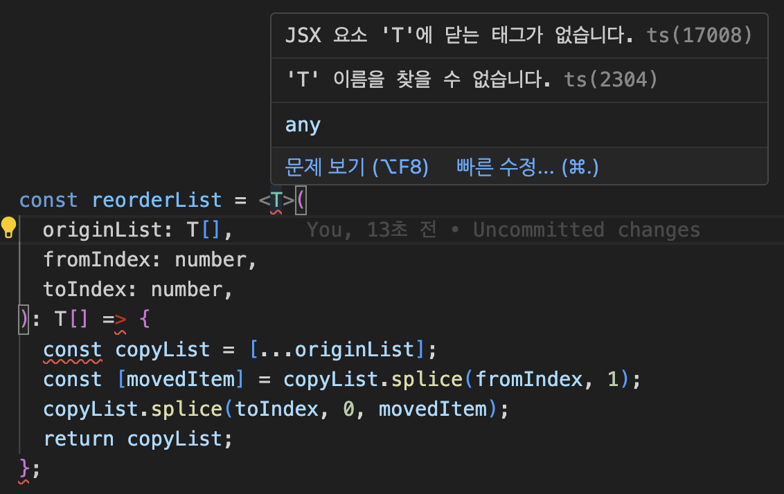

### 사건의 전말



위와 같은 함수를 tsx 파일에서 작성하려는데

컴파일 에러가 발생했다.

평소에 제네릭을 자주 사용하지 않아서 그런가?

뭐가 문제인지 인지 가늠조차 안되었다.

왜냐면 저거랑 비슷한 함수가 이미 프로젝트에 작성된게 있었기 때문이다.

아무리 차이점을 찾으려고 해도 뭐가 문제인지 못찾았다.


질문자가 바보니 답도 시원찮은 gpt...


결국 삼십분 고민하고 타입스크립트의 대가께 도움을 요청했고 실마리를 알려주셨다.

```tsx
const reorderList = <T,>(
  originList: T[],
  fromIndex: number,
  toIndex: number
): T[] => {
  const copyList = [...originList];
  const [movedItem] = copyList.splice(fromIndex, 1);
  copyList.splice(toIndex, 0, movedItem);
  return copyList;
};
```

함수 선언시 \<T\>가 아니라 <T,>로 하면 해결되었다. 콤마하나로..

<br/>

관련해서 왜 그런지 이유를 알고 싶었다.

이에 대해 뭔가 공식문서를 찾아보고 싶었는데

[stack overflow에서 관련한 논의](https://stackoverflow.com/questions/32696475/typescript-tsx-and-generic-parameters)를 찾을 수 있었다.

여기서 참조하고있는 [타입스크립트의 관련 이슈](https://github.com/microsoft/TypeScript/issues/4922)도 찾을 수 있었다.

### 결론

<b>ts 파일에서는 제네릭으로 컴파일러가 인식할 수 있지만 tsx에서는 태그와 구분을 하지 못한다.</b>

그래서 ,를 통해 구분하는 문법이 생긴것 같다.

이것은 무려 9년전에 논의된 사항이고

난 아직도 타입스크립트 지식이 부족하다 !
