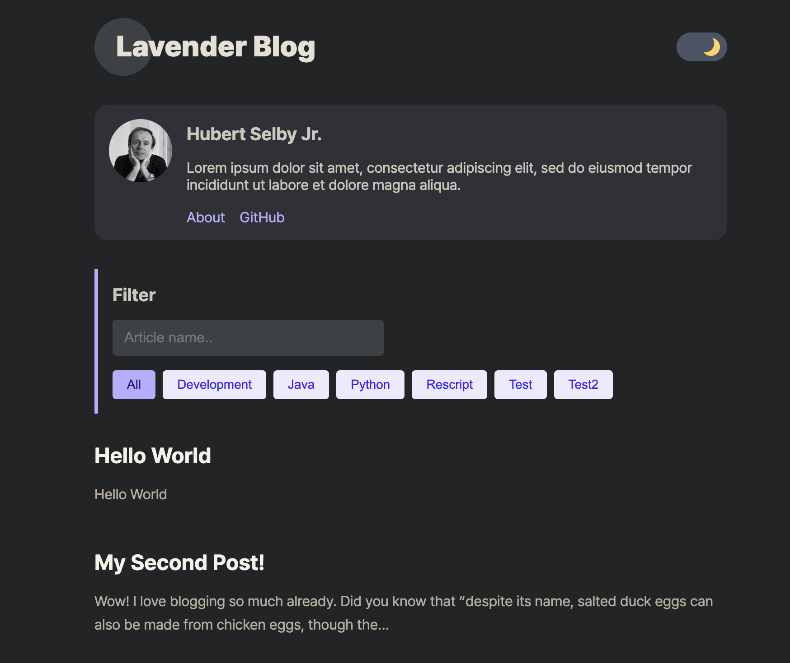
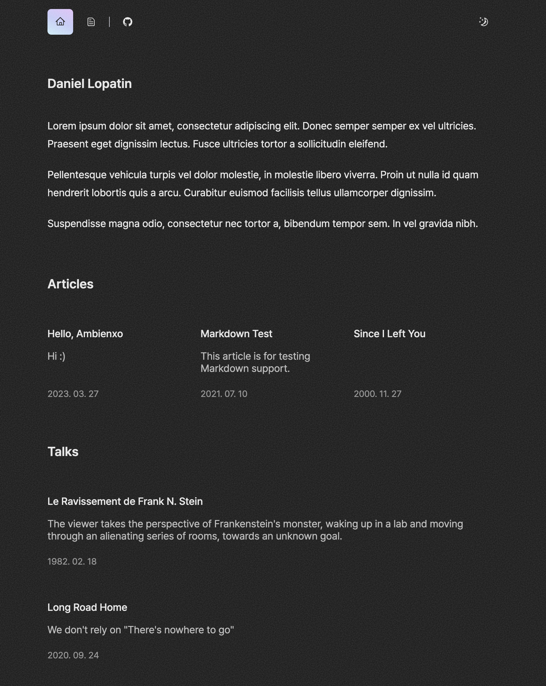

## 블로그를 드디어 시작했다

해야지 해야지 생각만하다가 못한게 벌써 1년정도 지났다.

그동안 쉽게 시작을 하지 못했던건 나 스스로 프론트엔드 개발자의 기술블로그에 대한 환상 같은게 있었다.

- 뭔가 화려하고 감각적인 디자인에
- 분명 인터렉션도 어마무시할 것이며
- 반응형, 다크모드는 당연하고 SEO 최적화 등등

엄청난 선입견에 휩싸여 시작하지 못했다.

그래서 직접 개발해야하나, 아니면 티스토리나 velog를 해야하나 고민이었다.

~~사실 티스토리로 몇번 올렸다가 마음에 안들어서 다시시작했다~~

 

## 탬플릿으로 쉽게 개발하자

그러던중 [오종택 개발자님의 기술블로그](https://saengmotmi.netlify.app/)를 보게되었고 생각보다 깔끔하고 정말 필요한 기능만 갖추고 있었다.

어떻게 구현하셨을까 깃허브에 들어가보았는데 [탬플릿](https://github.com/blurfx/gatsby-starter-lavender)을 이용하셨다는 사실을 알게되었다.

이미 잘만들어져 있는 탬플릿에 내가 원하는 커스텀만 살짝 첨가해서 진짜 내 블로그를 만들면 좋겠다 싶었다.

다 만들고나서 알게된 사실은, 저 탬플릿을 개발하신 분께서 [다른 탬플릿](https://github.com/blurfx/ambienxo)도 만드셔서 여러개 중에서 선택할 수 있었는데 살짝 아쉽다.

디자이너도 아니고 너무 미적인 부분에 치우쳐져있어서 정말 중요한 본질인 기록하는 것을 계속 오랜시간 놓치고 있었다.

사실 글감은 많다.

그동안 회사다니면서 해결한 이슈중에서 깊은 고민을 수반한 것들, 회사원들과의 스터디, 다른 사람의 아티클을 보면서 회사 프로젝트에 새롭게 적용할 수 있는 것들 등

글도 자꾸 써야 늘고 나만의 구조도 잡히고 더 읽기 쉬운 글이 되지 않을까 싶다.

 

## 더 친절한 블로그를 위한 TODO

1. 가능하다면 댓글 프로필 이미지 부분 사각형이 아니라 원형으로 수정하기

2. 글 리스트에서 썸네일, 날짜, 태그 보이게 레이아웃 수정하기

3. 날짜순이 아니라 지정하는 순서대로 리스트 보이게 하기

4. 글 하단에 우측글, 좌측글 이동하는 부분 좀더 직관적으로 수정하기

5. 글 하단에서 최상단으로 이동하는 버튼 혹은 블로그 제목은 상단 고정

6. 넓은 화면에서는 목차가 우측에 스크롤 따라다니게 수정하기

7. 거슬리지 않는 선에서 구글 애드센스 추가해보기

8. 태그마다 상단에 설명부분 추가하기

9. 작성중 상태 추가 - 클릭못하게하거나 변경될수있음 안내고려

10. 일주일내로 업로드된 글에 대해서는 NEW 뱃지 추가하기

 

---

gatsby에 graphql이라서 너무 구조가 생소하다. 수정하는게 쉽지않을 듯하다.
