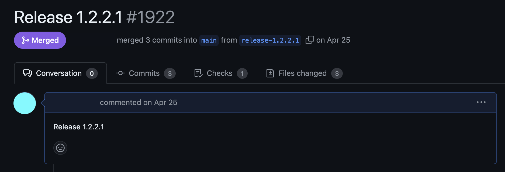

**OTL**

버전 체계에 대해 정확히 모르는 시절,

앞에 숫자는 <큰 업데이트>, 중간 숫자는 <정기적인 업데이트>, 마지막은 <자잘한 수정> 같았다.

정확한 차이와 그 규모의 경계는 모른 채

 

**TIL**

주.부.수로 구성되어있다.

영어로는 Major.Minor.Patch

**Major** 버전은 기존 버전과 **호환되지 않게 API가 바뀌면** 올리고

**Minor** 버전은 기존 버전과 **호환되면서 새로운 기능을 추가**하면 올리고

**Patch** 버전은 기존 버전과 **호환되면서 버그를 수정**한 것이라면 올린다.

이건 내가 옛날에 1.2.2 버전에서 아주 자잘한 버그를 수정하고 올린 버전인데

1.2.2 보다 아주 작은 수정이라서 1.2.2.1로 하였으나

이는 체계가 없는것이고 🥲

버전이라고도 부를수 없는 것이었다. 😞

 

만약에 버그수정에 있어서

기존과 호환이 되지 않는 API 수정이 이루어진다면

Major 버전을 올려야한다.

그렇지 않다면 기존 코드는 **Deprecated** 처리하고 새로운 코드를 추가하는 방법도 있다.
